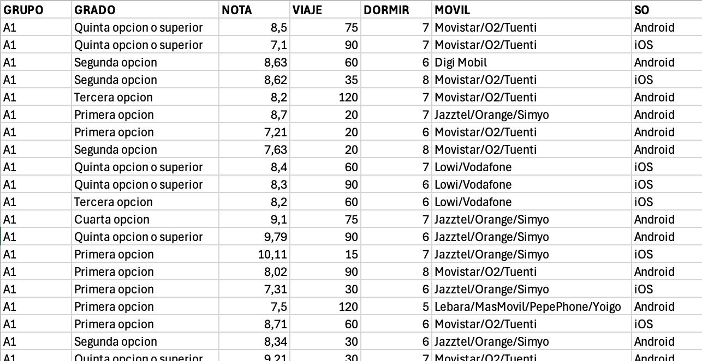

## 1. Introducción

Con esta práctica se trata de utilizar R y RStudio para calcular medidas estadísticas sobre una variable. Los conceptos teóricos pueden encontrarse explicados en <https://hilera.web.uah.es/estadistica/teoria/>.

Se usarán en los ejemplos los datos suministrados por los estudiantes de un curso de la asignatura Estadística del Grado en Ingeniería en Sistemas de Información de la Universidad de Alcalá. Con las siguientes variables estadísticas:

- GRUPO: Grupo de laboratorio
- GRADO: Orden de preferencia elegido para el Grado en Ingeniería en Sistemas de Información por la Universidad de Alcalá
- NOTA: Nota final de acceso a la universidad
- VIAJE: Tiempo en llegar a la Escuela Politécnica en minutos
- DORMIR: Horas que se duerme los días laborables
- MOVIL: Compañía de la línea móvil
- SO: Sistema operativo del móvil

{fig-align="center"}

Para evitar problemas, se han borrado las filas en las que había algún valor vacío, y el fichero resultante se encuentra en "[encuesta.csv](https://hilera.web.uah.es/estadistica/r/datos/encuesta.csv)".

Se debe cargar el fichero *encuesta.csv* en una variable de tipo *data.frame* usando la función *read.csv2()*, preparada para leer fichero csv con columnas separadas por ";" y decimales con ",". En este caso, se tomará el fichero de la URL de este repositorio, pero si te lo descargas en tu ordenador local, modifica la URL, por el nombre de tu ruta donde se encuentre el fichero.

```{webr-r}
(encuesta = read.csv2("https://raw.githubusercontent.com/nataliamontoyagom/interactiveStatisticsWebsite/main/encuesta.csv"))
```

Se pueden crear vectores indicando con *$* el nombre de la columna:

```{webr-r}
grupo = encuesta$GRUPO
grado = encuesta$GRADO
nota = encuesta$NOTA
viaje = encuesta$VIAJE
dormir = encuesta$DORMIR
movil = encuesta$MOVIL
so = encuesta$SO
```

El vector (nota) contiene:

```{webr-r}
nota
```

Han respondido 74 estudiantes a la encuesta, pero el número total de estudiantes matriculados es de 108. Por tanto, las 74 observaciones disponibles corresponden a una muestra:

- Muestra: 74 estudiantes que han respondido a la encuesta
- Población: 108 estudiantes matriculados

La medidas que se calcularán en esta práctica sobre los estudiantes serán, por tanto, estadísticos ya que se calculan sobre una muestra (74 estudiantes). Si dispusiéramos de los datos de toda la población (108 estudiantes). las medidas se denominarían parámetros. Por ejemplo, en el caso de la medida conocida como media, existen dos casos:

- Estadístico: “media muestral”. Si se calcula con las 74 observaciones de la muestra.
- Parámetro: “media poblacional”. Si se calcula con las 108 observaciones de la población.

## 2. Cálculo de medidas estadísticas

En este apartado se utilizará R para calcular medidas estadísticas de centralización, de posición, de dispersión y de forma.

### 2.1 Medidas de centralización

Las medidas de centralización o de posición de tendencia central indican un valor alrededor del cual se distribuyen las observaciones.


