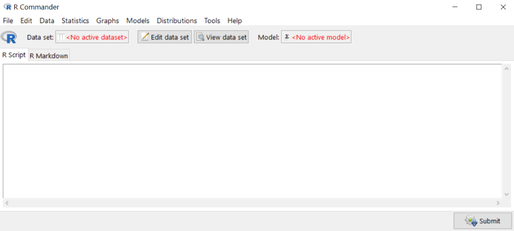
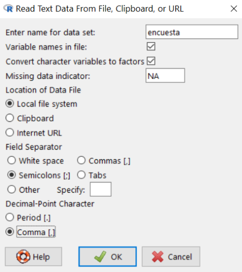
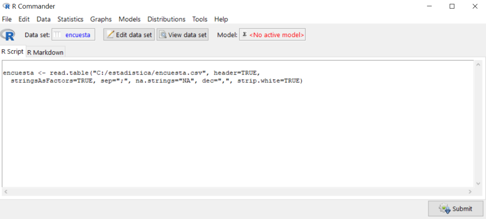
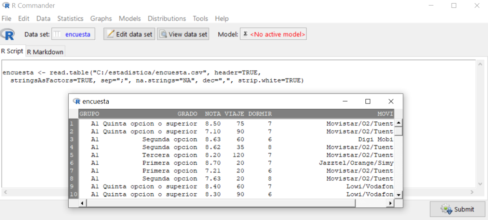
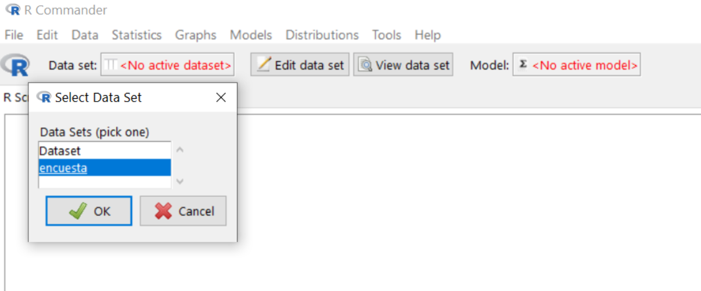
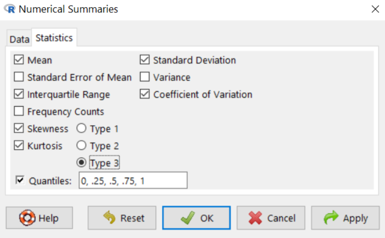
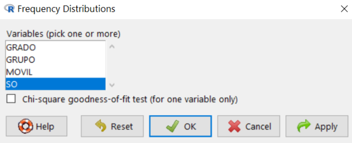
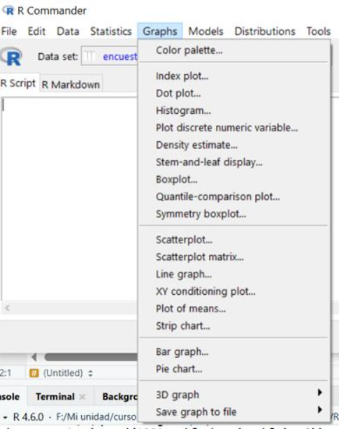
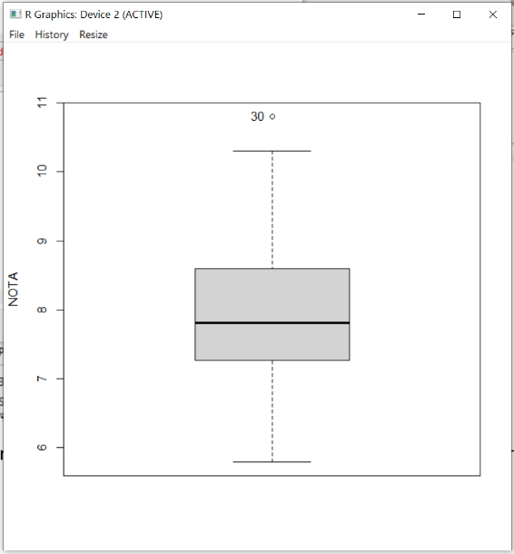

## 1. Introducción

Con esta práctica se trata de utilizar R y RStudio para calcular medidas estadísticas sobre una variable. Los conceptos teóricos pueden encontrarse explicados en <https://hilera.web.uah.es/estadistica/teoria/>.

Se usarán en los ejemplos los datos suministrados por los estudiantes de un curso de la asignatura Estadística del Grado en Ingeniería en Sistemas de Información de la Universidad de Alcalá. Con las siguientes variables estadísticas:

- GRUPO: Grupo de laboratorio
- GRADO: Orden de preferencia elegido para el Grado en Ingeniería en Sistemas de Información por la Universidad de Alcalá
- NOTA: Nota final de acceso a la universidad
- VIAJE: Tiempo en llegar a la Escuela Politécnica en minutos
- DORMIR: Horas que se duerme los días laborables
- MOVIL: Compañía de la línea móvil
- SO: Sistema operativo del móvil

{fig-align="center"}

Para evitar problemas, se han borrado las filas en las que había algún valor vacío, y el fichero resultante se encuentra en "[encuesta.csv](https://hilera.web.uah.es/estadistica/r/datos/encuesta.csv)".

Se debe cargar el fichero *encuesta.csv* en una variable de tipo *data.frame* usando la función *read.csv2()*, preparada para leer fichero csv con columnas separadas por ";" y decimales con ",". En este caso, se tomará el fichero de la URL de este repositorio, pero si te lo descargas en tu ordenador local, modifica la URL, por el nombre de tu ruta donde se encuentre el fichero.

```{webr-r}
(encuesta = read.csv2("https://raw.githubusercontent.com/nataliamontoyagom/interactiveStatisticsWebsite/main/encuesta.csv"))
```

Se pueden crear vectores indicando con *\$* el nombre de la columna:

```{webr-r}
grupo = encuesta$GRUPO
grado = encuesta$GRADO
nota = encuesta$NOTA
viaje = encuesta$VIAJE
dormir = encuesta$DORMIR
movil = encuesta$MOVIL
so = encuesta$SO
```

El vector (nota) contiene:

```{webr-r}
nota
```

Han respondido 74 estudiantes a la encuesta, pero el número total de estudiantes matriculados es de 108. Por tanto, las 74 observaciones disponibles corresponden a una muestra:

- Muestra: 74 estudiantes que han respondido a la encuesta
- Población: 108 estudiantes matriculados

La medidas que se calcularán en esta práctica sobre los estudiantes serán, por tanto, estadísticos ya que se calculan sobre una muestra (74 estudiantes). Si dispusiéramos de los datos de toda la población (108 estudiantes). las medidas se denominarían parámetros. Por ejemplo, en el caso de la medida conocida como media, existen dos casos:

- Estadístico: “media muestral”. Si se calcula con las 74 observaciones de la muestra.
- Parámetro: “media poblacional”. Si se calcula con las 108 observaciones de la población.

## 2. Cálculo de medidas estadísticas

En este apartado se utilizará R para calcular medidas estadísticas de centralización, de posición, de dispersión y de forma.

### 2.1 Medidas de centralización

Las medidas de centralización o de posición de tendencia central indican un valor alrededor del cual se distribuyen las observaciones.

+--------------------+-------------------------------------------------------------------------------------------------------------------------------------------------------------------------------------+----------------------------------------------------------------------------------------------------------------------------------------------------------------------------------------------------------------------------------------------------------------------------------------------------------------------------------------------+
| Medida             | R                                                                                                                                                                                   | Comentarios                                                                                                                                                                                                                                                                                                                                  |
+====================+=====================================================================================================================================================================================+==============================================================================================================================================================================================================================================================================================================================================+
| Media (aritmética) | ``` r                                                                                                                                                                               | *x* es un vector que contiene los valores de la variable estadística (cuantitativa), que deben ser valores numéricos. Se obtiene el cociente entre la suma de todos los valores y el número total de valores.                                                                                                                                |
|                    | mean(x)                                                                                                                                                                             |                                                                                                                                                                                                                                                                                                                                              |
|                    | ```                                                                                                                                                                                 |                                                                                                                                                                                                                                                                                                                                              |
|                    |                                                                                                                                                                                     |                                                                                                                                                                                                                                                                                                                                              |
|                    | El resultado sería NA si hay valores NA (no disponibles) en el vector *x*. Para calcular la media ignorando esos valores NA hay que utilizar el parámetro *na.rm*:                  |                                                                                                                                                                                                                                                                                                                                              |
|                    |                                                                                                                                                                                     |                                                                                                                                                                                                                                                                                                                                              |
|                    | ``` r                                                                                                                                                                               |                                                                                                                                                                                                                                                                                                                                              |
|                    | mean(x, na.rm=TRUE)                                                                                                                                                                 |                                                                                                                                                                                                                                                                                                                                              |
|                    | ```                                                                                                                                                                                 |                                                                                                                                                                                                                                                                                                                                              |
+--------------------+-------------------------------------------------------------------------------------------------------------------------------------------------------------------------------------+----------------------------------------------------------------------------------------------------------------------------------------------------------------------------------------------------------------------------------------------------------------------------------------------------------------------------------------------+
| Mediana            | ``` r                                                                                                                                                                               | *x* contiene valores numéricos (variable cuantitativa) Si *x* tiene un número impar de valores, la mediana es el número de la posición central. Si es par, la mediana es la media de los dos valores centrales.                                                                                                                              |
|                    | median(x)                                                                                                                                                                           |                                                                                                                                                                                                                                                                                                                                              |
|                    | ```                                                                                                                                                                                 |                                                                                                                                                                                                                                                                                                                                              |
+--------------------+-------------------------------------------------------------------------------------------------------------------------------------------------------------------------------------+----------------------------------------------------------------------------------------------------------------------------------------------------------------------------------------------------------------------------------------------------------------------------------------------------------------------------------------------+
| Moda               | No existe una función predefinida en R para la moda. Podemos crear una propia, como la siguiente, adaptada de la definida en [statology.org](https://www.statology.org/mode-in-r/): | Obtiene el valor del vector *x* que más se repite. Puede devolver un valor, o un vector de valores en el caso de que haya más de una moda, porque existan valores que se repiten el mismo número de veces (variable multimodal). *x* puede ser un vector de valores numéricos (variable cuantitativa) o no numéricos (variable cualitativa). |
|                    |                                                                                                                                                                                     |                                                                                                                                                                                                                                                                                                                                              |
|                    | ``` {.r .webr-r}                                                                                                                                                                    |                                                                                                                                                                                                                                                                                                                                              |
|                    | moda = function (x) {                                                                                                                                                               |                                                                                                                                                                                                                                                                                                                                              |
|                    |   u = unique(x)                                                                                                                                                                     |                                                                                                                                                                                                                                                                                                                                              |
|                    |   m = match(x,u)                                                                                                                                                                    |                                                                                                                                                                                                                                                                                                                                              |
|                    |   t = tabulate(m)                                                                                                                                                                   |                                                                                                                                                                                                                                                                                                                                              |
|                    |   return (u[t == max(t)])                                                                                                                                                           |                                                                                                                                                                                                                                                                                                                                              |
|                    | }                                                                                                                                                                                   |                                                                                                                                                                                                                                                                                                                                              |
|                    | ```                                                                                                                                                                                 |                                                                                                                                                                                                                                                                                                                                              |
|                    |                                                                                                                                                                                     |                                                                                                                                                                                                                                                                                                                                              |
|                    | O se puede instalar un paquete como “[modeest](https://cran.r-project.org/web/packages/modeest/index.html)” y usar la función *mlv*:                                                |                                                                                                                                                                                                                                                                                                                                              |
|                    |                                                                                                                                                                                     |                                                                                                                                                                                                                                                                                                                                              |
|                    | ``` r                                                                                                                                                                               |                                                                                                                                                                                                                                                                                                                                              |
|                    | install.packages("modeest")                                                                                                                                                         |                                                                                                                                                                                                                                                                                                                                              |
|                    | library(modeest)                                                                                                                                                                    |                                                                                                                                                                                                                                                                                                                                              |
|                    | mlv(x, method="mfv")                                                                                                                                                                |                                                                                                                                                                                                                                                                                                                                              |
|                    | ```                                                                                                                                                                                 |                                                                                                                                                                                                                                                                                                                                              |
+--------------------+-------------------------------------------------------------------------------------------------------------------------------------------------------------------------------------+----------------------------------------------------------------------------------------------------------------------------------------------------------------------------------------------------------------------------------------------------------------------------------------------------------------------------------------------+

: Tabla 1. Cálculo de medidas de centralización con R

#### 2.1.1 Ejemplos

1.  Media de la nota de acceso a la universidad (con dos cifras decimales)

```{webr-r}
encuesta = read.csv2("https://raw.githubusercontent.com/nataliamontoyagom/interactiveStatisticsWebsite/main/encuesta.csv")
nota = encuesta$NOTA
round(mean(nota),2)
```

2.  Mediana de la nota de acceso a la universidad

```{webr-r}
round(median(nota),2)
```

Al tener el vector un número par de valores (74), podemos comprobar que R ha calculado la mediana haciendo la media de los valores de las posiciones centrales 37 (7.804) y 38 (7.830).

```{webr-r}
sort(nota)
```

3.  Moda de la nota de acceso a la universidad

Podemos instalar el paquete *modeest* y usar la función *mlv*:

``` r
if (!require("modeest")) 
  install.packages("modeest")
library(modeest)
mlv(nota, method="mfv")
```

La variable *nota* tiene sólo una moda, es el valor 7.8, que se repite 4 veces. Se puede calcular el número de veces que se repite la moda, con este comando:

```{webr-r}
max(tabulate(match(nota, unique(nota))))
```

4.  Moda del sistema operativo de los teléfonos móviles de los estudiantes

```{webr-r}
moda = function (x) {
  u = unique(x)
  m = match(x,u)
  t = tabulate(m)
  return (u[t == max(t)])
}

so=encuesta$SO
moda(so)
```

### 2.2 Medidas de localización (o posición)

Las medidas de localización o de posición de tendencia no central, permiten conocer otros puntos característicos de la distribución que no son los valores centrales. Son valores de la distribución que la dividen en partes iguales, es decir en intervalos (cuantiles) que comprenden el mismo número de datos como los deciles, cuartiles y percentiles.

+--------------------------------+----------------------------------+-----------------------------------------------------------------------------------------------------------------------------------------------------------------------------------------+
| Medida                         | R                                | Comentarios                                                                                                                                                                             |
+================================+==================================+=========================================================================================================================================================================================+
| Percentil                      | ``` r                            | *p* representa el percentil divido entre 100. Por ejemplo, el percentil 35 se calcularía indicando p=0.35.                                                                              |
|                                | quantile(x,p,type=2)             |                                                                                                                                                                                         |
|                                | ```                              | NOTA: Se usa *type=2*, porque hay hasta 9 formas de calcular cuantiles[^1], y el tipo 2 coincide con la explicada en [teoría](https://hilera.web.uah.es/estadistica/teoria/index.html). |
+--------------------------------+----------------------------------+-----------------------------------------------------------------------------------------------------------------------------------------------------------------------------------------+
| Cuartil                        | ``` r                            | El primer cuartil (Q1) se obtiene con q=0.25.                                                                                                                                           |
|                                | quantile(x,t,type=2)             |                                                                                                                                                                                         |
|                                | ```                              | El segundo cuartil (Q2) con q=0.5.                                                                                                                                                      |
|                                |                                  |                                                                                                                                                                                         |
|                                |                                  | El tercer cuartil (Q3) con q=0.75.                                                                                                                                                      |
|                                |                                  |                                                                                                                                                                                         |
|                                |                                  | El cuarto cuartil (Q4) con q=1.                                                                                                                                                         |
+--------------------------------+----------------------------------+-----------------------------------------------------------------------------------------------------------------------------------------------------------------------------------------+
| Varios percentiles o cuartiles | ``` r                            | Se indican los percentiles o cuartiles en un vector.                                                                                                                                    |
|                                | quantile(x,c(c1,c2,c3..),type=2) |                                                                                                                                                                                         |
|                                | ```                              |                                                                                                                                                                                         |
+--------------------------------+----------------------------------+-----------------------------------------------------------------------------------------------------------------------------------------------------------------------------------------+

: Tabla 2. Cálculo de medidas de localización con R

[^1]: No existe un consenso sobre el método de cálculo de un percentil o un cuartil. Existen al menos 9 métodos diferentes, resumidos en un artículo de [Hyndman y Fan (1996)](https://www.jstor.org/stable/2684934). La función *quantile* de R permite hacer el cálculo usando los 9 métodos del artículo, indicando el número del método (1 a 9) mediante un parámetro “*type=n*”. Si no se utiliza el parámetro *type*, por defecto se aplica el método número 7. El algoritmo aplicado en cada método está explicado en el artículo y en la ayuda de R a la que se accede con *help(“quantile”)* y en [otras fuentes](https://blogs.sas.com/content/iml/2017/05/24/definitions-sample-quantiles.html). La diferencia de los resultados no es significativa, y se basa en la forma de considerar los casos en los que el porcentaje es un número exacto.

#### 2.2.1 Ejemplos

Vamos a redondear todos los resultados con 2 cifras decimales, usando la función *round()*.

1.  Percentil 10 de la nota de acceso a la universidad

```{webr-r}
round(quantile(nota,0.1,type=2),2)
```

Como hay 74 estudiantes, el 10% serían 7.4. Según la fórmula explicada en teoría, el percentil 10 sería 𝑋~⌊7.4⌋+1~ = 𝑋~7+1~ = 𝑥~8~. Si ordenamos la muestra y mostramos los 10 primeros valores, podemos comprobar que el de la posición 8 es 6.75 por lo que, en efecto ese es el percentil 10.

```{webr-r}
sort(nota) [1:10]
```

Lo que indica es que podemos asegurar que el 10% de los estudiantes de la muestra tiene una nota igual o inferior a 6.75, y que el 90% de los estudiantes tiene una nota de acceso igual o superior a 6.75.

2.  Primer y segundo cuartiles (Q1 y Q2) de la nota de acceso a la universidad

```{webr-r}
round(quantile(nota,c(0.25,0.5),type=2),2)
```

Lo que indica es que la cuarta parte (25%) de los estudiantes de la muestra tiene una nota de acceso igual o inferior a 7.27 y que la mitad de los estudiantes (50%) tiene una nota de acceso igual o inferior a 7.81. Ese valor coincide con la mediana.

```{webr-r}
round(median(nota),2)
```

3.  Tercer cuartil (Q3) de la nota de acceso a la universidad

```{webr-r}
round(quantile(nota,0.75),2)
```

Lo que indica que las tres cuartas partes (75%) de los estudiantes de la muestra tiene una nota de acceso igual o inferior a 8.6.

### 2.3 Medidas de dispersión

Las medidas de dispersión reflejan la heterogeneidad de las observaciones y dan una idea sobre la representatividad de las medidas de centralización, de tal forma que a mayor dispersión menor representatividad.

+-----------------------------------------------------+-----------------------------------------------------------------------------------------------------------------------+-------------------------------------------------------------------------------------------------------------------------------------------------------------------------------------------------------------------------------+
| Medida                                              | R                                                                                                                     | Comentarios                                                                                                                                                                                                                   |
+=====================================================+=======================================================================================================================+===============================================================================================================================================================================================================================+
| Rango                                               | ``` r                                                                                                                 | Como vector: *range* obtiene un vector con dos valores: el valor más bajo y el más alto incluido en el vector *x*.                                                                                                            |
|                                                     | range(x) max(x)-min(x)                                                                                                |                                                                                                                                                                                                                               |
|                                                     | ```                                                                                                                   | Como valor: Diferencia entre el valor máximo y el valor mínimo.                                                                                                                                                               |
+-----------------------------------------------------+-----------------------------------------------------------------------------------------------------------------------+-------------------------------------------------------------------------------------------------------------------------------------------------------------------------------------------------------------------------------+
| Varianza muestral o cuasivarianza (*s*^2^)          | ``` r                                                                                                                 | Obtiene la varianza de la muestra de los n valores incluidos en el vector *x*, según la fórmula: $$s^{2} = \frac{\Sigma^{n}_{i=1}(x_{i}-\bar{x})^{2}}{n-1} $$                                                                 |
|                                                     | var(x)                                                                                                                |                                                                                                                                                                                                                               |
|                                                     | ```                                                                                                                   |                                                                                                                                                                                                                               |
+-----------------------------------------------------+-----------------------------------------------------------------------------------------------------------------------+-------------------------------------------------------------------------------------------------------------------------------------------------------------------------------------------------------------------------------+
| Varianza poblacional ($\sigma^{2}$)                 | No existe una función predefinida en R para la varianza poblacional. Podemos crear una propia, como la siguiente:     | Si el vector *x* contiene los valores de una variable estadística de una población completa, la varianza poblacional es:                                                                                                      |
|                                                     |                                                                                                                       |                                                                                                                                                                                                                               |
|                                                     | ``` r                                                                                                                 | $$\sigma^{2} = \frac{\Sigma^{n}_{i=1}(x_{i}-\bar{x})^{2}}{n} $$                                                                                                                                                               |
|                                                     | var.pob = function(x) {                                                                                               |                                                                                                                                                                                                                               |
|                                                     |   n = length(x)                                                                                                       |                                                                                                                                                                                                                               |
|                                                     |   return(sum((x-mean(x))^2)/(n))                                                                                      |                                                                                                                                                                                                                               |
|                                                     | }                                                                                                                     |                                                                                                                                                                                                                               |
|                                                     | ```                                                                                                                   |                                                                                                                                                                                                                               |
+-----------------------------------------------------+-----------------------------------------------------------------------------------------------------------------------+-------------------------------------------------------------------------------------------------------------------------------------------------------------------------------------------------------------------------------+
| Desviación estándar o típica muestral (*s*)         | ``` r                                                                                                                 | Obtiene la desviación estándar de la muestra de los n valores incluidos en el vector *x*.                                                                                                                                     |
|                                                     | sd(x)                                                                                                                 |                                                                                                                                                                                                                               |
|                                                     | ```                                                                                                                   | $$s = \sqrt{\frac{\Sigma^{n}_{i=1}(x_{i}-\bar{x})^{2}}{n-1}} $$                                                                                                                                                               |
+-----------------------------------------------------+-----------------------------------------------------------------------------------------------------------------------+-------------------------------------------------------------------------------------------------------------------------------------------------------------------------------------------------------------------------------+
| Desviación estándar o típica poblacional ($\sigma$) | No existe una función predefinida en R para la cuasidesviación estándar. Podemos crear una propia, como la siguiente: | Si el vector *x* contiene los valores de una variable estadística de una población completa, la desviación estándar poblacional es:                                                                                           |
|                                                     |                                                                                                                       |                                                                                                                                                                                                                               |
|                                                     | ``` r                                                                                                                 | $$\sigma = \sqrt{\frac{\Sigma^{n}_{i=1}(x_{i}-\bar{x})^{2}}{n}} $$                                                                                                                                                            |
|                                                     | sd.pob = function(x) {                                                                                                |                                                                                                                                                                                                                               |
|                                                     |   n = length(x)                                                                                                       |                                                                                                                                                                                                                               |
|                                                     |   return(sqrt(sum((x-mean(x))^2)/(n-1)))                                                                              |                                                                                                                                                                                                                               |
|                                                     | }                                                                                                                     |                                                                                                                                                                                                                               |
|                                                     | ```                                                                                                                   |                                                                                                                                                                                                                               |
+-----------------------------------------------------+-----------------------------------------------------------------------------------------------------------------------+-------------------------------------------------------------------------------------------------------------------------------------------------------------------------------------------------------------------------------+
| Coeficiente de variación                            | ``` r                                                                                                                 | Se obtiene un valor entre 0 y 1.                                                                                                                                                                                              |
|                                                     | sd(x)/mean(x)                                                                                                         |                                                                                                                                                                                                                               |
|                                                     | ```                                                                                                                   | Cuanto menor sea su valor, mayor será la homogeneidad de los datos de la muestra y, por tanto, la media aritmética será una buena representante del conjunto de datos.[^2]                                                    |
+-----------------------------------------------------+-----------------------------------------------------------------------------------------------------------------------+-------------------------------------------------------------------------------------------------------------------------------------------------------------------------------------------------------------------------------+
| Rango intercuartílico                               | ``` r                                                                                                                 | Obtiene la diferencia entre el tercer cuartil (Q3) y el primero (Q1).                                                                                                                                                         |
|                                                     | IQR(x,type=2)                                                                                                         |                                                                                                                                                                                                                               |
|                                                     | ```                                                                                                                   | *IQR = Q3-Q1*                                                                                                                                                                                                                 |
|                                                     |                                                                                                                       |                                                                                                                                                                                                                               |
|                                                     |                                                                                                                       | Los datos atípicos están fuera del intervalo:                                                                                                                                                                                 |
|                                                     |                                                                                                                       |                                                                                                                                                                                                                               |
|                                                     |                                                                                                                       | *\[Q~1~ - 1.5IQR, Q~3~ + 1.5IQR\]*                                                                                                                                                                                            |
|                                                     |                                                                                                                       |                                                                                                                                                                                                                               |
|                                                     |                                                                                                                       | NOTA: Como en el caso de la función *quantile*, se usa *type=2*, porque hay hasta 9 formas de calcular cuantiles, y el tipo 2 coincide con la explicada en [teoría](https://hilera.web.uah.es/estadistica/teoria/index.html). |
+-----------------------------------------------------+-----------------------------------------------------------------------------------------------------------------------+-------------------------------------------------------------------------------------------------------------------------------------------------------------------------------------------------------------------------------+

: Tabla 3. Cálculo de medidas de dispersión con R

[^2]: Suele ocurrir en el campo de la Estadística que no hay consenso sobre la interpretación de los valores de algunas medidas estadísticas. Por ejemplo, en el caso del coeficiente de variación (CV), hay autores que afirman (también Wikipedia), que si CV≤0.3 la media aritmética es representativa de la muestra de datos, y por tanto es un conjunto de datos "Homogéneo"; mientras que si CV\>0.3, la media no es representativa del conjunto de datos por ser un conjunto de datos "Heterogéneo"). Sin embargo, otros autores afinan más y proponen más rangos de valores. Se recomienda consultar este [foro de discusión sobre valores aceptables para el coeficiente de variación](https://www.researchgate.net/post/What_are_the_acceptable_values_for_the_percentage_deviation_DEV_and_the_coefficient_of_variance_CV).

#### 2.3.1 Ejemplos

1.  Rango de la nota de acceso a la universidad

```{webr-r}
range(nota)
```

Como diferencia de notas es:

```{webr-r}
max(nota) - min(nota)
```

2.  Varianza de la nota de acceso a la universidad

NOTA: Se utiliza la varianza muestral o cuasivarianza, porque no se dispone de las notas de toda la población de estudiantes, sólo de una muestra, de los que respondieron a la encuesta.

```{webr-r}
round(var(nota),2)
```

3.  Desviación estándar o típica de la nota de acceso a la universidad

NOTA: Se dispone de una muestra, por lo que hay que calcular la desviación muestral.

```{webr-r}
round(sd(nota),2)
```

4.  Coeficiente de variación de la nota de acceso a la universidad

```{webr-r}
round(sd(nota)/mean(nota),2)
```

NOTA: Muchos autores afirman que si es menor a 0.3 el conjunto de datos puede considerarse homogéneo, como ocurre en este caso.

5.  Rango intercuartílico de la nota de acceso a la universidad

```{webr-r}
round(IQR(nota,type=2),2)
```

Los datos atípicos están fuera del intervalo: *\[Q~1~-1.5·IQR, Q~3~+1.5·IQR\] = \[5.29, 6.62\]*

```{webr-r}
Q1=round(quantile(nota,c(0.25)),2)
Q3=round(quantile(nota,c(0.75)),2)

Q1=as.double(Q1) #se usa as.double() para convertir a número
Q3=as.double(Q3)

round(Q1-1.5*IQR(nota,type=2),2)
round(Q3-1.5*IQR(nota,type=2),2)
```

### 2.4 Medidas de forma

Las medidas de forma permiten conocer la forma que tiene la curva que representa la distribución de la frecuencia de los valores de una muestra, normalmente un histograma. Se pueden utilizar para comparar con un posible conjunto de datos con la misma media y desviación estándar pero considerado como “normal”. Si imaginamos un histograma, se considera como “normal” una muestra de datos cuyo histograma se ajusta aproximadamente a la curva conocida como la campana de Gauss, que se puede dibujar con el siguiente comando de R:

`curve(dnorm(x,mean(muestra),sd(muestra)))`

Las dos medidas de forma más conocidas son los coeficientes de asimetría y de apuntamiento.

+--------------------------------------------+---------------------------------------------------------------------------------------------------------------------------------------+-------------------------------------------------------------------------------------------------------------------------------------------------------+
| Medida                                     | R                                                                                                                                     | Comentarios                                                                                                                                           |
+============================================+=======================================================================================================================================+=======================================================================================================================================================+
| Coeficiente de asimetría[^3]               | No existe una función predefinida en R, se puede crear una propia:                                                                    | Calcula el coeficiente de asimetría respecto a la media:                                                                                              |
|                                            |                                                                                                                                       |                                                                                                                                                       |
|                                            | ``` r                                                                                                                                 | $$\frac{\frac{1}{n}\Sigma^{n}_{i=1}(x_{i}-\bar{x})^{3}}{s^{3}}$$                                                                                      |
|                                            | asimetria = function(x) {                                                                                                             |                                                                                                                                                       |
|                                            |   n = length(x)                                                                                                                       | Si \>0, es asimétrica a la derecha, es decir, la mayoría de los valores son menores que la media.                                                     |
|                                            |   return ((1/n)*sum((x-mean(x))^3)/sd(x)^3)                                                                                           |                                                                                                                                                       |
|                                            | }                                                                                                                                     | Si \<0, es asimétrica a la izquierda, la mayoría de los valores son mayores que la media.                                                             |
|                                            | ```                                                                                                                                   |                                                                                                                                                       |
|                                            |                                                                                                                                       | Si =0, es simétrica, como la distribución "normal".                                                                                                   |
|                                            | Y usarla para calcular el coeficiente:                                                                                                |                                                                                                                                                       |
|                                            |                                                                                                                                       |                                                                                                                                                       |
|                                            | ``` r                                                                                                                                 |                                                                                                                                                       |
|                                            | asimetria(x)                                                                                                                          |                                                                                                                                                       |
|                                            | ```                                                                                                                                   |                                                                                                                                                       |
|                                            |                                                                                                                                       |                                                                                                                                                       |
|                                            | O se puede instalar un paquete como “[e1071](https://cran.r-project.org/web/packages/e1071/index.html)” y usar la función *skewness*: |                                                                                                                                                       |
|                                            |                                                                                                                                       |                                                                                                                                                       |
|                                            | ``` r                                                                                                                                 |                                                                                                                                                       |
|                                            | install.packages("e1071")                                                                                                             |                                                                                                                                                       |
|                                            | library(e1071)                                                                                                                        |                                                                                                                                                       |
|                                            | skewness(x)                                                                                                                           |                                                                                                                                                       |
|                                            | ```                                                                                                                                   |                                                                                                                                                       |
+--------------------------------------------+---------------------------------------------------------------------------------------------------------------------------------------+-------------------------------------------------------------------------------------------------------------------------------------------------------+
| Coeficiente de apuntamiento o curtosis[^4] | No existe una función predefinida en R, se puede crear una propia:                                                                    | Calcula el coeficiente de apuntamiento respecto a la media:                                                                                           |
|                                            |                                                                                                                                       |                                                                                                                                                       |
|                                            | ``` r                                                                                                                                 | $$\frac{\frac{1}{n}\Sigma^{n}_{i=1}(x_{i}-\bar{x})^{4}}{s^{4}}-3$$                                                                                    |
|                                            | curtosis = function(x) {                                                                                                              |                                                                                                                                                       |
|                                            |   n = length(x)                                                                                                                       | Si \>0, cuanto mayor sea, habrá mucha diferencia de frecuencia entre los valores (histograma con pendiente muy abrupta). Se dice que es leptocúrtica. |
|                                            |   return (((1/n)*sum((x-mean(x))^4)/sd(x)^4)-3)                                                                                       |                                                                                                                                                       |
|                                            | }                                                                                                                                     | Si es \<0, cuanto menor sea, la frecuencia de los valores será más parecida (histograma más plano). Se dice que es platicúrtica.                      |
|                                            | ```                                                                                                                                   |                                                                                                                                                       |
|                                            |                                                                                                                                       | Si =0, tiene un apuntamiento como la distribución “normal”. Se dice que es mesocúrtica.                                                               |
|                                            | Y usarla para calcular el coeficiente:                                                                                                |                                                                                                                                                       |
|                                            |                                                                                                                                       |                                                                                                                                                       |
|                                            | ``` r                                                                                                                                 |                                                                                                                                                       |
|                                            | curtosis(x)                                                                                                                           |                                                                                                                                                       |
|                                            | ```                                                                                                                                   |                                                                                                                                                       |
|                                            |                                                                                                                                       |                                                                                                                                                       |
|                                            | O se puede instalar un paquete como “[e1071](https://cran.r-project.org/web/packages/e1071/index.html)” y usar la función *kurtosis*: |                                                                                                                                                       |
|                                            |                                                                                                                                       |                                                                                                                                                       |
|                                            | ``` r                                                                                                                                 |                                                                                                                                                       |
|                                            | install.packages("e1071")                                                                                                             |                                                                                                                                                       |
|                                            | library(e1071)                                                                                                                        |                                                                                                                                                       |
|                                            | kurtosis(x)                                                                                                                           |                                                                                                                                                       |
|                                            | ```                                                                                                                                   |                                                                                                                                                       |
+--------------------------------------------+---------------------------------------------------------------------------------------------------------------------------------------+-------------------------------------------------------------------------------------------------------------------------------------------------------+

: Tabla 4. Cálculo de medidas de forma con R

[^3]: Como ocurre con otras medidas, no hay consenso sobre cómo calcular el coeficiente de asimetría. Aquí usamos la fórmula indicada, pero existen otras opciones, como se explican en este artículo de [Joanes y Gill (1998)](https://www.jstor.org/stable/2988433). Si instalamos el paquete “[e1071](https://cran.r-project.org/web/packages/e1071/index.html)” se puede usar la función *skewness* para calcular el coeficiente de asimetría de tres formas distintas, para lo cual se puede utilizar un parámetro type con tres posibles valores: 1, 2 y 3. Por defecto se considera el tipo 3, que coincide con la fórmula usada en esta práctica.

[^4]: Tampoco hay consenso sobre cómo calcular el coeficiente de apuntamiento. Aquí usamos la fórmula indicada, pero existen otras opciones, como se explican en este artículo de [Joanes y Gill (1998)](https://www.jstor.org/stable/2988433). Si instalamos el paquete “[e1071](https://cran.r-project.org/web/packages/e1071/index.html)” se puede usar la función *kurtosis* para calcular el coeficiente de apuntamiento de tres formas distintas, para lo cual se puede utilizar un parámetro type con tres posibles valores: 1, 2 y 3. Por defecto se considera el tipo 3, que coincide con la fórmula usada en esta práctica.

Se puede hacer un estudio de la normalidad de una variable en función del valor de sus coeficientes de asimetría y apuntamiento. Existen propuestas de rangos de valores admitidos para cada coeficiente. No se puede asegurar con certeza que una variable sea normal, por lo que su estudio se llevará a cabo en las prácticas sobre estadística inferencial en las que se realizarán pruebas de hipótesis.

#### 2.4.1 Ejemplos

1.  Coeficiente de asimetría de las notas de acceso a la universidad

Podemos instalar el paquete *e1071* y usar la función *skewness*:

```{r}
if(!require("e1071")) 
  install.packages("e1071")
```

```{webr-r}
library(e1071)
round(skewness(nota),2)
```

Al ser un valor positivo, la mayoría de los valores son menores que la media. La distribución es asimétrica a la derecha o positiva. Se puede comprobar que es así, si extraemos los valores menores que la media.

```{webr-r}
length(nota[nota<mean(nota)])
```

Del total de 74 notas, hay 45 notas menores que la media y 29 mayores. Podemos comprobar visualmente la asimetría dibujando un histograma, la mediana con una línea continua roja y la media con una línea punteada roja. Se comprueba gráficamente que, en efecto, es asimétrica a la derecha.

```{webr-r}
hist(nota)
abline(v=mean(nota), lwd=2, lty=3, col="darkred")
```

2.  Coeficiente de apuntamiento o curtosis de las notas de acceso a la universidad

Podemos utilizar la función *kurtosis* del paquete *e1071*:

```{r}
if (!require("e1071")) 
  install.packages("e1071")
```

```{webr-r}
library(e1071)
round(kurtosis(nota),2)
```

Como es menor que cero, la distribución es platicúrtica, es decir, tiene poco apuntamiento. No hay muchas diferencias entre las frecuencias de los valores, hay menos diferencia que en caso de una variable “normal”.

### 2.5 Resumen de medidas

Existe en R la función *summary* que obtiene un resumen de las principales medidas estadísticas descriptivas: valores mínimo y máximo, media, mediana, y primer y tercer cuartil.

```{webr-r}
round(summary(nota),2)
```

## 3. Tabla de frecuencias

Las principales tablas de frecuencias se obtienen como se indica en la siguiente tabla:

+---------------------------------+----------------------+--------------------------------------------------------------------------------------------------------------------------------------+
| Operación                       | R                    | Comentarios                                                                                                                          |
+=================================+======================+======================================================================================================================================+
| Tabla de frecuencias absolutas  | ``` r                | Número de veces que se repite cada valor de la variable estadística en el vector *x*.                                                |
|                                 | table(x)             |                                                                                                                                      |
|                                 | ```                  |                                                                                                                                      |
+---------------------------------+----------------------+--------------------------------------------------------------------------------------------------------------------------------------+
| Tabla de frecuencias relativas  | ``` r                | Se obtiene el valor de cada frecuencia absoluta dividido por el número total de valores de la variable estadística en el vector *x*. |
|                                 | prop.table(table(x)) |                                                                                                                                      |
|                                 | ```                  |                                                                                                                                      |
|                                 |                      |                                                                                                                                      |
|                                 | O bien:              |                                                                                                                                      |
|                                 |                      |                                                                                                                                      |
|                                 | ``` r                |                                                                                                                                      |
|                                 | table(x)/length(x)   |                                                                                                                                      |
|                                 | ```                  |                                                                                                                                      |
+---------------------------------+----------------------+--------------------------------------------------------------------------------------------------------------------------------------+
| Tabla de frecuencias acumuladas | ``` r                | Obtiene una tabla con la Suma todos los valores.                                                                                     |
|                                 | cumsum(table(x))     |                                                                                                                                      |
|                                 | ```                  |                                                                                                                                      |
+---------------------------------+----------------------+--------------------------------------------------------------------------------------------------------------------------------------+

Se pueden crear tablas de frecuencias absolutas de cualquier variable estadística, por ejemplo:

```{webr-r}
frec.abs.nota=table(encuesta$NOTA)
frec.abs.dormir=table(encuesta$DORMIR)
frec.abs.so=table(encuesta$SO)
```

Y también tablas de frecuencias relativas:

```{webr-r}
frec.rel.nota=prop.table(frec.abs.nota)
frec.rel.dormir=prop.table(frec.abs.dormir)
frec.rel.so=prop.table(frec.abs.so)
```

Y tablas de frecuencias acumuladas:

```{webr-r}
frec.acu.nota= cumsum(frec.abs.nota)
frec.acu.dormir= cumsum(frec.abs.dormir)
frec.acu.so= cumsum(frec.abs.so)
```

Se puede comprobar que se han creado, por ejemplo, las del sistema operativo del móvil:

```{webr-r}
frec.abs.so
```

```{webr-r}
frec.rel.so
```

```{webr-r}
frec.acu.so
```

O de las de la variable que representa las horas que duermen los estudiantes (redondeamos los valores de las frecuencias relativas para que se muestren pocos decimales, por ejemplo 3):

```{webr-r}
frec.abs.dormir
```

```{webr-r}
round(frec.rel.dormir,3)
```

```{webr-r}
frec.acu.dormir
```

Se puede comprobar con la función *sum* que la suma de las frecuencias relativas es 1:

```{webr-r}
sum(frec.rel.dormir)
```

### 3.1 Tabla de frecuencias absolutas para datos agrupados en intervalos de clase

Cuando una variable estadística cuantitativa es continua, es habitual que las frecuencias no se calculen para cada valor sino para una clase o intervalo de valores.

En ese caso, la tabla de frecuencias absolutas se calcula de la siguiente forma:

``` r
K = número de intervalos o clases
C = diff(range(x))/K
Li = min(x)
L = Li + C*(0:K)
x.agrupada = cut(x, breaks=L, right=FALSE)
frec.abs.agrupada = table(x.agrupada)
```

El significado de cada variable es:

- **c**: Amplitud de clase o tamaño de cada intervalo
- **Li**: Límite inferior del intervalo de la primera clase
- **L**: Vector con los límites de cada clase

Podemos aplicarlo para obtener la tabla de frecuencias absolutas de la nota de acceso a la universidad agrupada en 4 intervalos[^5].

[^5]: Aunque en este ejemplo, por simplicidad, se utilizan 4 intervalos, se podría haber aplicado la [regla de Sturges](https://es.wikipedia.org/wiki/Regla_de_Sturges) para calcular cuál es el número recomendado de intervalos para una muestra de tamaño 74, usando el comando `ceiling(1+3.322*log10(74))`. Se obtiene el valor 8, por lo que, según esta regla, se recomendaría utilizar 8 intervalos.

```{webr-r}
K = 4
C = diff(range(nota))/K
Li=min(nota)
L = Li+C*(0:K)
nota.agrupada = cut(nota, breaks=L, right=FALSE, include.lowest=TRUE)
frec.abs.nota.agrupada = table(nota.agrupada)
frec.abs.nota.agrupada
```

Podemos comprobar que en la tabla se contabilizan 73 valores, cuando en la variable nota hay 74. Se ha perdido el valor más alto, porque los intervalos están abiertos a la derecha, lo que quiere decir que el extremo derecho del intervalo no está incluido en el mismo.

Para evitar perder ese valor, hay que indicar que el último intervalo debe estar cerrado a la derecha, y eso se consigue con el atributo `include.lowest=true`:

```{webr-r}
nota.agrupada = cut(nota, breaks=L, right=FALSE, include.lowest = TRUE)
frec.abs.nota.agrupada = table(nota.agrupada)
frec.abs.nota.agrupada
```

Ahora sí se han incluido en la tabla los 74 valores de nota, por lo que hay que hacerlo de esta forma.

Para entender el funcionamiento, podemos analizar el resultado de cada comando.

1.  El primer comando obtiene la variable K con el número de intervalos que queremos:

```{webr-r}
(K = 4)
```

2.  El segundo comando obtiene una variable C que representa la amplitud de clase o tamaño de cada uno de los cuatro intervalos en que hay que dividir el rango de valores disponibles en el vector nota:

```{webr-r}
(C = diff(range(nota))/K)
```

3.  El tercer comando obtiene la variable Li, que representa el límite inferior del primer intervalo o intervalo de la primera clase, que debe coincidir con el mínimo valor en el vector nota:

```{webr-r}
(Li = min(nota))
```

4.  El cuarto comando obtiene un vector L, con los valores de los límites de cada intercalo. Al haber dividido en 4 intervalos, hay 5 valores:

```{webr-r}
(L = Li+C*(0:K))
```

5.  El quinto comando obtiene un vector *nota.agrupada*,

```{webr-r}
(nota.agrupada = cut(nota, breaks=L, right=FALSE, include.lowest = TRUE))
```

6.  El sexto comando obtiene la tabla de frecuencias absolutas:

```{webr-r}
(frec.abs.nota.agrupada = table(nota.agrupada))
```

### 3.2 Tabla de frecuencias relativas para datos agrupados en intervalos de clase

Hay dos opciones para calcular las frecuencias relativas a partir de las absolutas.

1.  Utilizando la función *prop.table*

```{webr-r}
(frec.rel.nota.agrupada = prop.table(frec.abs.nota.agrupada))
```

2.  Dividiendo las frecuencias absolutas por el número de datos

```{webr-r}
(frec.rel.nota.agrupada = frec.abs.nota.agrupada/length(nota))
```

### 3.3 Media de una variable a partir de datos agrupados

Se calcula considerando que hay un valor (marca) que representa a todos los datos incluidos en un mismo intervalo. Ese valor o marca es el punto medio de cada intervalo intervalo:

```{webr-r}
(marcas = (L[1:K]+L[1:K+1])/2)
```

Una vez que obtenemos las marcas, sólo hay que multiplicar cada marca por la frecuencia del intervalo al que representa:

```{webr-r}
(media.nota.agrupada=sum(marcas*frec.rel.nota.agrupada))
```

Podemos comparar con la media que se obtiene con todos los datos sin agrupar:

```{webr-r}
mean(nota)
```

Vemos que son muy parecidas, pero no iguales ya que al agrupar se pierde información.

Se podrían calcular de forma similar otras medidas como la varianza o la desviación estándar.

## 4. Gráficos

Algunos gráficos que se pueden dibujar utilizando funciones de R sobre los valores de una variable estadística son histogramas, diagramas de barras, diagramas de tarta, diagramas de caja (box plot) y diagramas de tallo y hojas.

### 4.1 Diagrama de tallo y hojas

Se realiza para variables cuantitativas, utilizando la función *stem(variable)*.

Podemos utilizar, por ejemplo, la variable DORMIR sobre las horas que duermen los alumnos:

```{webr-r}
dormir
```

Y realizar el diagrama de tallo y hojas:

```{webr-r}
stem(dormir)
```

Podemos comprobar visualmente que 7 horas es el valor más usual, después 6 horas y luego 8 horas.

Se puede hacer el diagrama de otras variables numéricas, por ejemplo las notas de acceso.

```{webr-r}
nota
```

En este caso, al tener 2 dígitos decimales, la función *stem* de R aplica previamente un redondeo a una sola cifra.

```{webr-r}
stem(nota)
```

Observamos que las notas que más se repiten son las que están en el rango de 7 a 7.9 puntos.

Para que no se aplique el redondeo, se puede utilizar el parámetro `scale`, indicando `scale=3`.

```{webr-r}
stem(nota, scale=3)
```

### 4.2 Diagrama de barras

Se suele realizar para variables cualitativas, y para variables cuantitativas si tienen un número reducido de valores diferentes.

Se realiza con la función *barplot()*, a partir de la tabla de frecuencias absolutas o relativas. Por ejemplo, de la variable estadística GRADO, que representa en qué opción eligió un alumno la titulación de Grado en Ingeniería en Sistemas de Información.

```{webr-r}
frec.abs.grado = table(grado)
barplot(frec.abs.grado)
```

Si queremos que aparezcan en otro orden, se puede definir un orden:

```{webr-r}
orden=c("Primera opcion","Segunda opcion","Tercera opcion","Cuarta opcion","Quinta opcion o superior")
barplot(frec.abs.grado[orden])
```

En la función *barplot* se pueden utilizar parámetros como:

- Título del diagrama: `main="título"`
- Subtítulo del diagrama: `sub=”subtítulo”`
- Etiqueta para el eje x: `xlab=”etiqueta”`
- Etiqueta para el eje y: `ylab=”etiqueta”`
- Color de la línea: `col=”color”` (ej. “red”, “blue”, “green”, etc., lista completa en https://r-charts.com/es/colores/)
- Color del borde de las columnas: `border=”color”`

Un ejemplo sería:

```{webr-r}
barplot (frec.abs.grado, main="Elección de la titulación GISI", xlab="Orden de
opción seleccionada", ylab="Alumnos", col="yellow", border="red")
```

Se puede indicar un color para cada barra:

```{webr-r}
barplot (frec.abs.grado, col=c("red","green","blue","yellow","pink"))
```

O aplicar una gama de colores usando la función `heat`.

```{webr-r}
barplot (frec.abs.grado, col=heat.colors(5))
```

Para conocer más parámetros de la función *barplot* se puede consultar la ayuda de R:

```{webr-r}
help(barplot)
```

### 4.3 Diagrama de Pareto

Es un diagrama de barras en orden descendente según frecuencias absolutas, en el que se superpone una línea con las frecuencias acumuladas.

Para dibujarlo se puede importar el paquete “*qcc*”:

```{webr-r}
if (!require("qcc")) 
  install.packages("qcc")
library(qcc)
```

Y se obtiene con la función *pareto.chart*, a la que se pasa como parámetro la tabla de frecuencias absolutas.

```{webr-r}
pareto.chart(frec.abs.grado)
```

### 4.4 Diagrama de tarta

Se utiliza con variables cualitativas.

```{webr-r}
pie(frec.abs.grado)
```

Se puede indicar un color y una densidad de rallado para cada valor de la variable.

```{webr-r}
pie(frec.abs.grado, col=c("red","brown","blue","yellow","pink"),
density=c(10,10,30,20,20))
```

Para conocer más parámetros de la función *pie* se puede consultar la ayuda de R:

```{webr-r}
help(pie)
```

### 4.5 Diagrama de caja (box plot)

Sólo se puede realizar para variables cuantitativas. En un diagrama de caja se muestra información que también se obtiene con la función *summary*.

```{webr-r}
summary(nota)
```

El diagrama se dibuja utilizando la función *boxplot(variable)* y la función *segments()* para dibujar también la media dentro de la caja, como una línea roja discontinua.

```{webr-r}
boxplot(nota)
segments(x0=0.8, y0=mean(nota), x1=1.2, y1=mean(nota), col="red", lwd=2, lty=2)
```

La línea sólida que aparece dentro de la caja representa la mediana (7.81), el borde inferior de la caja es el primer cuartil (Q1=7.27), y el borde superior el tercer cuartil (Q3=8.60). Por tanto la altura de la caja es el rango intercuartílilco (IQR=1.32).

Fuera de la caja hay unas líneas llamadas bigotes (whiskers), que se dibujan en a una distancia de 1.5\*IQR de los bordes inferior y superior. Excepto en el caso de que este valor sea, respectivamente, menor que el mínimo de la variable o mayor que el máximo. En este ejemplo:

- El bigote inferior sería *Q1-1.5\*IQR=7.27-1.5\*1.32=5.29*, pero como este valor es menor que el mínimo de la variable (5.80), entonces el bigote corresponde al valor mínimo de la variable.
- El bigote superior sería *Q3+1.5\*IQR=8.6+1.5\*1.32=10.58*. Como no es mayor que el valor máximo de la variable (10.80), entonces en este caso es el valor calculado.

El un diagrama de caja se dibujan con puntos los denominados “datos atípicos” (outliers), que son los valores de la variable fueran de los bigotes. En este ejemplo sólo hay uno, se trata de la nota 10.80, es es mayor al bigote superior (10.58).

Se pueden utlizar parámentos de la función *boxplot*, para mejorar el diagrama. Por ejemplo:

- Con el parámetro `horizontal=TRUE`, se dibuja en horizontal.

- Con el parámetro `outline=FALSE`, no se dibujan los datos atípicos.

- Con el parámetro `main` se indica el título del diagrama.

- Con el parámetro `col` se indica el color de relleno de la caja.

```{webr-r}
boxplot(nota, horizontal=TRUE, outline=FALSE, main="Diagrama de caja de las notas de acceso", col="green")
```

Para conocer más parámetros de la función *boxplot* se puede consultar la ayuda de R:

```{webr-r}
help(boxplot)
```

### 4.6 Histograma

Sólo se pueden realizar para variables cuantitativas.

```{webr-r}
hist(nota)
```

El número de clases o barras (*bins*) del diagrama por defecto es el que establece la fórmula de Sturges[^6]. Aunque se pueden utilizar fórmulas propuestas por otros autores, mediante el parámetro `breaks`:

[^6]: R no aplica estrictamente la fórmula de Sturges, que en este caso sería `1+log2(74)=8`. Existe una función en R para calcular la fórmula de Sturges: `nclass.Sturges(nota)`, y también se obtiene 8. Sin embargo, podemos comprobar que en el histograma hay 11 barras y no 8 como debería haber. En cambio, la fórmula de Scott si se aplica correctamente, pues con la fórmula se obtiene el valor 6 con `nclass.Scott(nota)`, y en el diagrama en efecto hay 6 barras.

- Fórmula de Sturges: `breaks=”Sturges”` (por defecto)

- Fórmula de Scott: `breaks=”Scott”`

- Fórmula de Freedman-Diaconis: `breaks=”FD”`

Por ejemplo, usando la propuesta de Scott:

```{webr-r}
hist(nota, breaks="Scott")
```

En el primer caso, por defecto se dibujaron 11 barras, mientras que en el segundo caso el diagrama se divide en sólo 6 barras.

Se puede usar el parámetro breaks para indicar un vector con los puntos en los que debe terminar cada columna. Por ejemplo, podríamos dibujar el histograma de notas para ver las notas de aprobado (entre 5 y 7), las de notable (entre 7 y 9) y las de sobresaliente (entre 9 y 11). Y añadir el parámetro labels, para que aparezca un texto sobre cada barra:

```{webr-r}
hist(nota,breaks=c(5,7,9,11),labels=c("Aprobado","Notable","Sobresaliente"))
```

Se podría usar el vector *L* que se generó con los límites de los intervalos de datos agrupados, por ejemplo, para cuatro intervalos o clases:

```{webr-r}
K = 4
C = diff(range(nota))/K
Li = min(nota)
L = Li+C*(0:K)
hist(nota,breaks=L)
```

Y si queremos que se vea la posición de la media y la mediana, podemos dibujar sobre el diagrama una línea vertical roja discontinua en el valor de la media y una línea roja continua en el valor de al mediana.

```{webr-r}
abline(v=mean(nota), lwd=2, lty=3, col="darkred")
abline(v=median(nota), lwd=2, col="darkred")
```

En la función *hist* se pueden parámetros como:

- Título del diagrama: `main=”título”`
- Subtítulo del diagrama: `sub=”subtítulo”`
- Etiqueta para el eje x: `xlab=”etiqueta”`
- Etiqueta para el eje y: `ylab=”etiqueta”`
- Grosor de la línea: `lwd=”número”`
- Color de la línea: `col=”color”` (ej. “red”, “blue”, “green”, etc., lista completa en https://r-charts.com/es/colores/)
- Límites del eje x: `xlim=c(mínimo,máximo)`
- Límites del eje y: `xlim=c(mínimo,máximo)`
- Tipo de línea: `lty=0,1,2,3,4,5,6` (0=invisible, 1=sólida, 2=rayas, 3=puntos, 4=puntos y rayas, 5= rayas largas, 6=rayas cortas y largas)
- Número de frecuencia encima de cada columna: `labels=TRUE`
- Color del borde de las columnas: `border=”color”`

Un ejemplo sería:

```{webr-r}
hist (nota, main="Histograma de nota", ylab="Frecuencia", lwd=5, col="yellow", lty=2, xlim = c(5,12), ylim=c(0,20), labels=TRUE, border = "darkred")
```

### 4.7 Polígono de frecuencias

Un polígono de frecuencias se dibuja con líneas que unan los puntos medios de las barras de un histograma.

Puede hacerse de la siguiente forma.

```{webr-r}
h=hist(nota)
lines(h$mids,h$counts, col="darkred", lwd=5)
```

Se han incluido los parámetros `col` para el color de la línea y `lwd` para el grosor.

## 5. Ejercicios propuestos

Resolver los siguientes ejercicios, leyendo previamente el fichero `encuesta.csv`:

```{webr-r}
encuesta = read.csv2("https://raw.githubusercontent.com/nataliamontoyagom/interactiveStatisticsWebsite/main/encuesta.csv")
```

Se pide realizar un análisis de variable estadística VIAJE, que representa el tiempo (en minutos) en llegar a la universidad, convirtiendo previamente los valores de minutos a horas con dos dígitos decimales,

```{webr-r}
viaje=encuesta$VIAJE
viajeH=round(viaje/60,digits=2)
```

Calcular para dicha variable (en horas):

1.  Medidas de centralización: media, mediana, moda.

```{webr-r}

```

2.  Medidas de dispersión: rango, desviación estándar, varianza y coeficiente de variación.

```{webr-r}

```

3.  Medidas de localización: cuartiles y los percentiles 33 y 66.

```{webr-r}

```

4.  Medidas de forma: coeficiente de asimetría y coeficiente de apuntamiento o curtosis.

```{webr-r}

```

5.  Diagrama de caja. ¿Hay algún dato atípico?

```{webr-r}

```

6.  Tabla de frecuencias para los datos agrupados en 10 clases (intervalos).

```{webr-r}

```

7.  Media para los datos agrupados en esas 10 clases.

```{webr-r}

```

8.  Histograma y diagrama de tarta para esas 10 clases.

```{webr-r}

```

## 6. Referencias recomendadas

- [Estadística con R](https://r-coder.com/estadistica-r/) (J.C. Soage)
- [Statology](https://www.statology.org/r-guides/) (Z. Bobbitt)
- [Elementary Statistics with R](http://www.r-tutor.com/elementary-statistics) (C. Yau)
- [Estadística descriptiva: representaciones gráficas](http://wpd.ugr.es/~bioestad/guia-de-r/practica-2/) (D. Molina, A.M. Lara)

## 7. Anexo: R Commander[^7]

[^7]: Se recomienda consultar: <https://wpd.ugr.es/~bioestad/guia-r-commander/> y también <https://estadistica-dma.ulpgc.es/cursoR4ULPGC/12-Rcommander.html>

Se puede utilizar la aplicación *R Commander* para simplificar los cálculos estadísticos. Se trata de una aplicación que permite elegir al usuario las medidas estadísticas y los gráficos que quiere obtener, y genera automáticamente los comandos de R necesarios para conseguirlo.

Se instala como un paquete de R denominado “`Rcmdr`”:

``` r
if (!require("Rcmdr")) 
  install.packages("Rcmdr", dependencies=TRUE)
library(Rcmdr)
```

Al ejecutar library aparece una ventana con *R Commander* funcionando.

{fig-align="center" width="562"}

Se puede cerrar desde `File > Exit > From Commander`.

Para volver a abrirlo hay que ejecutar:

``` r
Commander()
```

### 7.1 Importar datos

Para cargar los datos de un archivo csv latino hay que seleccionar la opción: `Data > Import data > from text file`, y elegir separador de campos el punto y coma (Semicolons), y como carácter decimal la coma (Comma), y podemos dar el valor “*encuesta*” al nombre del conjunto de datos.

{fig-align="center" width="299"}

Al seleccionar Ok, se. ha creado el conjunto de datos, y en la pestaña `RScript` aparece el comando de R usado para hacerlo.

{fig-align="center" width="460"}

En la consola de *RStudio* también aparece automáticamente el comando:

``` r
encuesta <- read.table("C:/estadistica/encuesta.csv", header=TRUE, stringsAsFactors=TRUE, sep=";", na.strings="NA", dec=",", strip.white=TRUE)
```

Se puede ver el conjunto de datos en *R Commander* seleccionando el botón `View data set`.

{fig-align="center" width="390"}

Si se cierra *R Commander*, cuando se abra de nuevo se habrá perdido el conjunto de datos. Se puede volver a recuperar, seleccionado `<No active dataset>` → encuesta.

{fig-align="center" width="467"}

### 7.2 Calcular medidas estadísticas

Para obtener el resumen de medidas de la variable *NOTA*, se puede seleccionar: `Statistics > Summaries > Numerical summaries > Data > NOTA > Statistics`. Y marcar las medidas que interesen.

NOTA: Hay que elegir `Type 3`, para que la fórmula de cálculo de los coeficientes de asimetría y apuntamiento sea la misma que la utilizada por las funciones *Skewness* y *Kurtosis* usadas anteriormente en esta práctica.

{fig-align="center" width="299"}

Se ha generado automáticamente un comando numSummary y se pueden ver los resultados en la consola de *RStudio*:

``` r
numSummary(encuesta[,"NOTA", drop=FALSE], statistics=c("mean", "sd", "IQR", "quantiles", "cv", "skewness", "kurtosis"), quantiles=c(0,.25,.5,.75,1), type="3")
```

### 7.3 Obtener tablas de frecuencias

`R Commander` sólo realiza tablas de frecuencias para datos cualitativos, por lo que no se puede utilizar para generar tablas de frecuencias para datos numéricos agrupados.

Por ejemplo, se pude usar para la tabla de frecuencias de la variable *SO*, cuyos valores son “*Android*” o “*iOS*”, seleccionando `Statistics > Frequency Distiributions > Variables > SO`.

{fig-align="center" width="425"}

Se genera automáticamente un comando y se pueden ver los resultados en la consola de *RStudio*:

``` r
local({
  .Table <- with(encuesta, table(SO))
  cat("\ncounts:\n")
  print(.Table)
  cat("\npercentages:\n")
  print(round(100*.Table/sum(.Table), 2))
})
```

### 7.3 Generar gráficos

Se pueden generar gráficos estadísticos desde la sección “`Graphs`”.

{fig-align="center"}

Por ejemplo, seleccionando la opción `Boxplot > NOTA`, se puede obtener un diagrama de caja para la variable *NOTA*.

{fig-align="center" width="299"}

El comando ejecutado puede verse en la consola de *RStudio*:

``` r
Boxplot( ~ NOTA, data=encuesta, id=list(method="y"))
```
