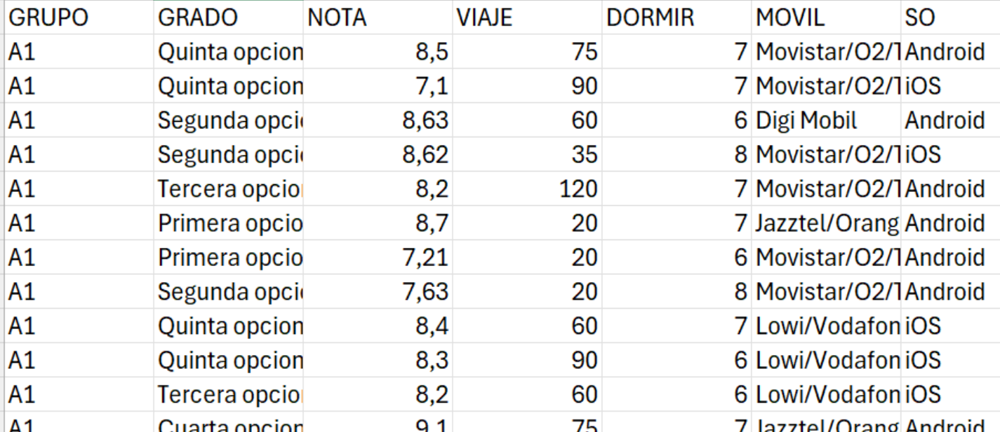
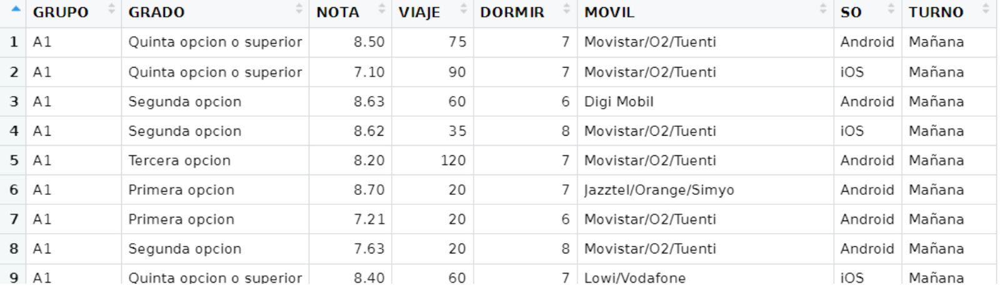

## 1. Introducción

Con esta práctica se trata de utilizar R y RStudio para calcular medidas estadísticas sobre dos variables, para analizar las posibles relaciones entre ellas.

Se usarán en los ejemplos los datos suministrados por los estudiantes de un curso de la asignatura Estadística del Grado en Ingeniería en Sistemas de Información de la Universidad de Alcalá. Con las siguientes variables estadísticas:

- GRUPO: Grupo de laboratorio
- GRADO: Orden de preferencia elegido para el Grado en Ingeniería en Sistemas de Información por la Universidad de Alcalá
- NOTA: Nota final de acceso a la universidad
- VIAJE: Tiempo en llegar a la Escuela Politécnica en minutos
- DORMIR: Horas que se duerme los días laborables
- MOVIL: Compañía de la línea móvil
- SO: Sistema operativo del móvil

{fig-align="center" width="638"}

Para evitar problemas, se han borrado las filas en las que había algún valor vacío, y el fichero resultante se encuentre en “[encuesta.csv](https://hilera.web.uah.es/estadistica/r/datos/encuesta.csv)”.

Se debe cargar el fichero encuesta.csv en una variable de tipo data.frame usando la función *read.csv2()*, preparada para leer fichero csv con columnas separadas por “;” y decimales con “,”.

### 1.1 Creación de una variable estadística auxiliar

Cuando hay que realizar un análisis estadístico, es posible que haya que crear nuevas variables estadísticas auxiliares, a partir de alguna de las variables estadísticas disponibles en el archivo de datos.

Por ejemplo, en el archivo de la encuesta, la variable GRUPO indica si un estudiante pertenece a uno de cuatro grupos posibles: A1, A2, B1, B2. Si los grupos A1 y A2 son del turno de mañana y los grupos B1 y B2 son del turno de tarde, podría interesar crear una nueva variable estadística auxiliar que representase el TURNO, con los posibles valores “Mañana” o “Tarde”.

Con los siguientes comandos se crea una variable de tipo tabla con una nueva columna TURNO.

```{webr-r}
encuesta = read.csv2("https://raw.githubusercontent.com/nataliamontoyagom/interactiveStatisticsWebsite/main/encuesta.csv")
encuesta.mañana=encuesta[((encuesta$GRUPO=="A1")|(encuesta$GRUPO=="A2")),]
encuesta.tarde=encuesta[((encuesta$GRUPO=="B1")|(encuesta$GRUPO=="B2")),]
encuesta.mañana$TURNO=rep(c("Mañana"),times=nrow(encuesta.mañana))
encuesta.tarde$TURNO=rep(c("Tarde"),times=nrow(encuesta.tarde))
encuesta.con.turno=rbind(encuesta.mañana, encuesta.tarde)
```

Puede visualizarse el contenido de la nueva variable creada en forma de tabla:

``` r
View(encuesta.con.turno)
```



## 2. Covarianza y coeficiente de correlación

Las funciones para calcular la covarianza y el coeficiente de correlación entre dos variables son las que se indican en la siguiente tabla:

+-----------------------------------------+------------------------------+--------------------------------------------------------------------------------+
| Operación                               | R                            | Comentarios                                                                    |
+=========================================+==============================+================================================================================+
| Covarianza                              | ``` r                        | Las variables deben ser numéricas y tener la misma longitud (valores).         |
|                                         | cov(x,y)                     |                                                                                |
|                                         | ```                          |                                                                                |
+-----------------------------------------+------------------------------+--------------------------------------------------------------------------------+
| Matriz de covarianzas                   | ``` r                        | En dataframe solo puede haber variables numéricas.                             |
|                                         | cov(dataframe)               |                                                                                |
|                                         | ```                          |                                                                                |
+-----------------------------------------+------------------------------+--------------------------------------------------------------------------------+
| Coeficiente de correlación (de Pearson) | Si no hay valores nulos:     | Las variables deben ser numéricas y tener la misma longitud (valores).         |
|                                         |                              |                                                                                |
|                                         | ``` r                        | Para valores nulos consultar la ayuda de *RStudio* sobre el argumento “`use`”. |
|                                         | cor(x, y)                    |                                                                                |
|                                         | ```                          |                                                                                |
|                                         |                              |                                                                                |
|                                         | Si hay valores nulos:        |                                                                                |
|                                         |                              |                                                                                |
|                                         | ``` r                        |                                                                                |
|                                         | cor(x, y, use=”…”)           |                                                                                |
|                                         | ```                          |                                                                                |
+-----------------------------------------+------------------------------+--------------------------------------------------------------------------------+
| Coeficiente de correlación de Kendall   | ``` r                        |                                                                                |
|                                         | cor(x, y, method=”kendall”)  |                                                                                |
|                                         | ```                          |                                                                                |
+-----------------------------------------+------------------------------+--------------------------------------------------------------------------------+
| Coeficiente de correlación de Spearman  | ``` r                        |                                                                                |
|                                         | cor(x, y, method=”spearman”) |                                                                                |
|                                         | ```                          |                                                                                |
+-----------------------------------------+------------------------------+--------------------------------------------------------------------------------+
| Matriz de correlaciones                 | ``` r                        | En dataframe solo puede haber variables numéricas.                             |
|                                         | cor(dataframe)               |                                                                                |
|                                         | ```                          |                                                                                |
+-----------------------------------------+------------------------------+--------------------------------------------------------------------------------+

#### Ejemplos

1.  Correlación entre las variables VIAJE y DORMIR

```{webr-r}
cor(encuesta$VIAJE,encuesta$DORMIR)
```

2.  Matriz de correlaciones (se crea un data frame con las variables numéricas)

```{webr-r}
encuesta.num=data.frame(encuesta$NOTA,encuesta$VIAJE,encuesta$DORMIR)
cor(encuesta.num)
```

3.  Matriz de covarianzas

```{webr-r}
cov(encuesta.num)
```

## 3. Diagrama de dispersión

Se obtienen con el código R que se indica en la siguiente tabla[^1]:

[^1]: Aunque la recta de regresión forma parte de la estadística inferencial, se incluye en esta práctica sobre estadística descriptica a efectos informativos para conocer las funciones que ofrece R sobre ello, ya que no se ha previsto realizar una práctica específica para modelos de regresión.

+---------------------------------------------------------------------+-----------------------------+------------------------------------------------+
| Operación                                                           | R                           | Comentarios                                    |
+=====================================================================+=============================+================================================+
| Diagrama de dispersión de la variable y en función de la variable x | ``` r                       |                                                |
|                                                                     | plot(x,y)                   |                                                |
|                                                                     | ```                         |                                                |
+---------------------------------------------------------------------+-----------------------------+------------------------------------------------+
| Recta de regresión de y en función de x:                            | ``` r                       | $$b = \frac{𝐶𝑜𝑣(𝑥, 𝑦)}{S^{2}_{x}}$$            |
|                                                                     | b=cov(x,y)/var(x)           |                                                |
| $$y = a + bx$$                                                      | a=mean(y)-b*mean(x)         | $$a = \bar{y}-b\bar{x}$$                       |
|                                                                     |                             |                                                |
| Método 1: Calculando coeficientes                                   | plot(x,y)                   |                                                |
|                                                                     | abline(a,b)                 |                                                |
|                                                                     | ```                         |                                                |
+---------------------------------------------------------------------+-----------------------------+------------------------------------------------+
| \$\$\$\$Recta de regresión de y en función de x:                    | ``` r                       | El símbolo \~ se obtiene con:                  |
|                                                                     | mod.reg.lineal=lm(y ~ x)    |                                                |
| $$y = a + bx$$                                                      |                             | - Alt + 126 con teclado numérico               |
|                                                                     | plot(x,y)                   |                                                |
| Método 2: Calculando modelo de regresión lineal                     | abline(mod.reg.lineal)      | - Alt Gr + 4 con teclado normal                |
|                                                                     | ```                         |                                                |
|                                                                     |                             | - Alt+ñ (Mac)                                  |
+---------------------------------------------------------------------+-----------------------------+------------------------------------------------+
| Ver coeficientes de la recta de regresión usando el modelo          | ``` r                       |                                                |
|                                                                     | mod.reg.lineal$coefficients |                                                |
|                                                                     | ```                         |                                                |
+---------------------------------------------------------------------+-----------------------------+------------------------------------------------+
| Resumen del modelo                                                  | ``` r                       |                                                |
|                                                                     | summary(mod.reg.lineal)     |                                                |
|                                                                     | ```                         |                                                |
+---------------------------------------------------------------------+-----------------------------+------------------------------------------------+
| Predecir un valor de y a partir de un valor de x                    | ``` r                       | Se aplica la fórmula de la recta de regresión. |
|                                                                     | valor.y=a+b*valor.x         |                                                |
|                                                                     | ```                         |                                                |
+---------------------------------------------------------------------+-----------------------------+------------------------------------------------+

#### Ejemplos

1.  Diagrama de dispersión de DORMIR en función de VIAJE

```{webr-r}
plot(encuesta$VIAJE,encuesta$DORMIR)
```

2.  Recta de regresión de DORMIR en función de VIAJE (calculando coeficientes)

```{webr-r}
x=encuesta$VIAJE
y=encuesta$DORMIR
plot(x,y)
(b=cov(x,y)/var(x))
(a=mean(y)-b*mean(x))
abline(a, b)
```

3.  Recta de regresión de DORMIR en función de VIAJE (calculando modelo lineal)

```{webr-r}
x=encuesta$VIAJE
y=encuesta$DORMIR
plot(x,y)
mod.reg.lineal=lm(y ~ x)
abline(mod.reg.lineal)
```

4.  Ver coeficientes de la recta de regresión usando el modelo

```{webr-r}
mod.reg.lineal$coefficients
```

5.  Si una persona tardase 150 minutos en viajar a la escuela, ¿Cuántas horas duerme? Se trata de predecir el valor de la variable DORMIR (y) a partir de la variable VIAJE (x), usando la fórmula de la recta de regresión: `y=a+bx`.

```{webr-r}
x=encuesta$VIAJE
y=encuesta$DORMIR
b=cov(x,y)/var(x)
a=mean(y)-b*mean(x)

a+b*150
```

## 4. Tablas de contingencia

Una tabla de contingencia es una tabla de frecuencias para una variable estadística bidimensional, en la que aparecen las frecuencias para las combinaciones de valores de las dos variables que forman la variable bidimensional.

Las principales tablas de frecuencias se obtienen como se indica en la siguiente tabla:

+---------------------------------------------------------------------------------+------------------------------------------------+---------------------------------------------------------------------------------------------------------------------------------------------------+
| Operación                                                                       | R                                              | Comentarios                                                                                                                                       |
+=================================================================================+================================================+===================================================================================================================================================+
| Tabla de frecuencias absolutas de dos variables                                 | ``` r                                          | Los valores de *x* son los nombres de las filas. Los valores de y son los nombres de las columnas.                                                |
|                                                                                 | table(x,y)                                     |                                                                                                                                                   |
|                                                                                 | ```                                            |                                                                                                                                                   |
+---------------------------------------------------------------------------------+------------------------------------------------+---------------------------------------------------------------------------------------------------------------------------------------------------+
| Tabla de frecuencias relativas                                                  | ``` r                                          | Se calcula dividendo las absolutas por el número total de combinaciones (x,y) de la tabla.                                                        |
|                                                                                 | prop.table(table(x,y))                         |                                                                                                                                                   |
|                                                                                 | ```                                            |                                                                                                                                                   |
+---------------------------------------------------------------------------------+------------------------------------------------+---------------------------------------------------------------------------------------------------------------------------------------------------+
| Tabla de frecuencias relativas condicionadas                                    | ``` r                                          | Si `n=1` calcula las frecuencias relativas de la variable y condicionada a los valores de *x*. La suma de las frecuencias de cada fila es 1.      |
|                                                                                 | prop.table(table(x,y),n)                       |                                                                                                                                                   |
|                                                                                 | ```                                            | Si `n=2` calcula las frecuencias relativas de la variable *x* condicionada a los valores de *y*. La suma de las frecuencias de cada columna es 1. |
+---------------------------------------------------------------------------------+------------------------------------------------+---------------------------------------------------------------------------------------------------------------------------------------------------+
| Tabla de frecuencias absolutas que incluye frecuencias marginales (márgenes)    | ``` r                                          |                                                                                                                                                   |
|                                                                                 | addmargins(table(x,y))                         |                                                                                                                                                   |
|                                                                                 | ```                                            |                                                                                                                                                   |
+---------------------------------------------------------------------------------+------------------------------------------------+---------------------------------------------------------------------------------------------------------------------------------------------------+
| Tabla de frecuencias relativas que incluye frecuencias marginales               | ``` r                                          |                                                                                                                                                   |
|                                                                                 | addmargins(prop.table(table(x,y))              |                                                                                                                                                   |
|                                                                                 | ```                                            |                                                                                                                                                   |
+---------------------------------------------------------------------------------+------------------------------------------------+---------------------------------------------------------------------------------------------------------------------------------------------------+
| Tabla de frecuencias relativas condicionadas que incluye frecuencias marginales | ``` r                                          | `n=1` o `n=2`                                                                                                                                     |
|                                                                                 | addmargins(prop.table(table(x,y),n))           |                                                                                                                                                   |
|                                                                                 | ```                                            |                                                                                                                                                   |
+---------------------------------------------------------------------------------+------------------------------------------------+---------------------------------------------------------------------------------------------------------------------------------------------------+
| Obtener frecuencias marginales a partir de una tabla de frecuencias absolutas   | ``` r                                          | Si `n=1` devuelve una tabla con las frecuencias absolutas marginales de la primera variable (*x*).                                                |
|                                                                                 | margin.table(table(x,y), margin=n)             |                                                                                                                                                   |
|                                                                                 | ```                                            | Si `n=2` devuelve una tabla con las frecuencias absolutas marginales de la segunda variable (*y*).                                                |
+---------------------------------------------------------------------------------+------------------------------------------------+---------------------------------------------------------------------------------------------------------------------------------------------------+
| Obtener frecuencias marginales a partir de una tabla de frecuencias relativas   | ``` r                                          | `n=1` o `n=2`                                                                                                                                     |
|                                                                                 | margin.table(prop.table(table(x,y)), margin=n) |                                                                                                                                                   |
|                                                                                 | ```                                            |                                                                                                                                                   |
+---------------------------------------------------------------------------------+------------------------------------------------+---------------------------------------------------------------------------------------------------------------------------------------------------+

#### Ejemplos

1.  Tabla de frecuencias absolutas de las variables *GRUPO* y *SO*, y con frecuencias absolutas marginales.

```{webr-r}
(t.abs.grupo.so=table(encuesta$GRUPO,encuesta$SO))
addmargins(t.abs.grupo.so)
```

2.  Tabla de frecuencias relativas de la variables *GRUPO* y *SO*, y con frecuencias relativas marginales.

```{webr-r}
(t.rel.grupo.so=prop.table(t.abs.grupo.so))
addmargins(t.rel.grupo.so)
```

3.  Tabla de contingencia de la variable *GRUPO* condicionada a la variable *SO*.

Se trata de dibujar una tabla con las frecuencias absolutas, las frecuencias absolutas marginales (*f*) y las frecuencias relativas marginales (*h*) obtenidas en los dos apartados anteriores.

+-----------+------------+------------+-----------+------------+
| GRUPO/SO  | Android    | iOS        | f~GRUPO~  | h~GRUPO~   |
+===========+============+============+===========+============+
| **A1**    | 14         | 9          | 23        | 0.31081081 |
+-----------+------------+------------+-----------+------------+
| **A2**    | 13         | 6          | 19        | 0.25675676 |
+-----------+------------+------------+-----------+------------+
| **B1**    | 12         | 7          | 19        | 0.25675676 |
+-----------+------------+------------+-----------+------------+
| **B2**    | 11         | 2          | 13        | 0.17567568 |
+-----------+------------+------------+-----------+------------+
| **f~SO~** | 50         | 24         | 74        |            |
+-----------+------------+------------+-----------+------------+
| **h~SO~** | 0.67567568 | 0.32432432 |           | 1          |
+-----------+------------+------------+-----------+------------+

4.  Tabla de frecuencias relativas de la variable *SO* condicionada a la variable *GRUPO*, y con frecuencias marginales (la suma de cada fila debe ser 1 en la columna de frecuencia marginal).

```{webr-r}
(t.rel.cond.grupo=prop.table(t.abs.grupo.so,1))
addmargins(t.rel.cond.grupo)
```

5.  Tabla de frecuencias relativas de la variable *GRUPO* condicionada a la variable *SO*, y con frecuencias marginales (la suma de cada columna debe ser 1 en la fila de frecuencia marginal).

```{webr-r}
(t.rel.cond.so=prop.table(t.abs.grupo.so,2))
addmargins(t.rel.cond.so)
```

6.  Obtener las frecuencias marginales a partir de las frecuencias absolutas y relativas de la variable *GRUPO*.

```{webr-r}
margin.table(t.abs.grupo.so,margin=1)
margin.table(t.rel.grupo.so,margin=1)
```

7.  Obtener las frecuencias marginales a partir de las frecuencias absolutas y relativas de la variable *SO*.

```{webr-r}
margin.table(t.abs.grupo.so,margin=2)
margin.table(t.rel.grupo.so,margin=2)
```

8.  Tabla de frecuencias absolutas para las variables *TURNO* y *SO*, y con frecuencias absolutas marginales.

En el apartado 1.1 de esta práctica se había creado una variable *encuesta.con.turno*, que contenía una nueva columna `TURNO` que representaba una variable estadística auxiliar, que indicaba si un estudiante pertenece al turno de Mañana (cuando está en el grupo A1 o A2) o al grupo de Tarde (cuando está en el grupo B1 o B2).

```{webr-r}
(t.abs.turno.so=table(encuesta.con.turno$TURNO,encuesta.con.turno$SO))
addmargins(t.abs.turno.so)
```

9.  Tabla de frecuencias relativas de las variables *TURNO* y *SO*, y con frecuencias relativas marginales.

```{webr-r}
(t.rel.turno.so=prop.table(t.abs.turno.so))
addmargins(t.rel.turno.so)
```

10. Tabla de contingencia de la variable *TURNO* condicionada a la variable *SO.*

Se trata de dibujar una tabla con las frecuencias absolutas, las frecuencias absolutas marginales (*f*) y las frecuencias relativas marginales (*h*) obtenidas en los dos apartados anteriores. Para simplificar, redondeamos a dos decimales las frecuencias relativas.

+------------+-----------+-----------+-----------+-----------+
| TURNO/SO   | Android   | iOS       | f~TURNO~  | h~TURNO~  |
+============+===========+===========+===========+===========+
| **Mañana** | 27        | 15        | 42        | 0.57      |
+------------+-----------+-----------+-----------+-----------+
| **Tarde**  | 23        | 9         | 32        | 0.43      |
+------------+-----------+-----------+-----------+-----------+
| **f~SO~**  | 50        | 24        | 74        |           |
+------------+-----------+-----------+-----------+-----------+
| **h~SO~**  | 0.68      | 0.32      |           | 1         |
+------------+-----------+-----------+-----------+-----------+

11. Tabla de contingencia de la variable *NOTA* agrupada en intervalos de clase, condicionada a la variable *SO*.

Hay que decidir los intervalos de clase en los que agrupar las notas. Podemos agrupar en un número de intervalos o clases cercano al recomendando por la regla de Sturges, que en este caso es 8:

```{webr-r}
#Regla de Sturges para una muestra de tamaño 74
ceiling(1+3.322*log10(74))
```

Un número razonable de intervalos en este caso serían 6 intervalos iguales de 1 punto cada uno, desde la nota 5 hasta 11.

La tabla de contingencia para nota y turno con frecuencias absolutas se obtendría con los siguientes comandos:

```{webr-r}
#Tabla de contingencia con 6 clases
L=c(5,6,7,8,9,10,11)
nota.agrupada=cut(encuesta$NOTA, breaks=L, right=FALSE, include.lowest = TRUE)
addmargins(table(nota.agrupada,encuesta$SO))
round(addmargins(prop.table(table(nota.agrupada,encuesta$SO))),2)
```

La tabla de contingencia sería la siguiente:

+--------------+------------+------------+------------+------------+
| NOTA/SO      | Android    | iOS        | f~NOTA~    | h~NOTA~    |
+==============+============+============+============+============+
| **\[5, 6)**  | 2          | 0          | 2          | 0.03       |
+--------------+------------+------------+------------+------------+
| **\[6,7)**   | 5          | 4          | 9          | 0.12       |
+--------------+------------+------------+------------+------------+
| **\[7,8)**   | 22         | 9          | 31         | 0.42       |
+--------------+------------+------------+------------+------------+
| **\[8,9)**   | 12         | 6          | 18         | 0.24       |
+--------------+------------+------------+------------+------------+
| **\[9,10)**  | 7          | 0          | 7          | 0.09       |
+--------------+------------+------------+------------+------------+
| **\[10,11)** | 2          | 5          | 7          | 0.09       |
+--------------+------------+------------+------------+------------+
| **f~SO~**    | 50         | 24         | 74         |            |
+--------------+------------+------------+------------+------------+
| **h~SO~**    | 0.67567568 | 0.32432432 |            | 1          |
+--------------+------------+------------+------------+------------+

## 5. Cálculo de medidas estadísticas marginales con varias variables

Se trata de calcular las medidas de cada variable de forma independiente, sin tener en cuenta el valor de las otras variables.

+----------------------------------+---------------------------------+-------------------------------------------------------------------------------+
| Operación                        | R                               | Comentarios                                                                   |
+==================================+=================================+===============================================================================+
| Resumen                          | ``` r                           | En dataframe están las variables.                                             |
|                                  | summary(dataframe)              |                                                                               |
|                                  | ```                             |                                                                               |
+----------------------------------+---------------------------------+-------------------------------------------------------------------------------+
| Medias marginales                | ``` r                           | Si puede haber valores no válidos, se puede añadir el parámetro `na.rm=TRUE`. |
|                                  | sapply(dataframe,mean)          |                                                                               |
|                                  | ```                             |                                                                               |
+----------------------------------+---------------------------------+-------------------------------------------------------------------------------+
| Medianas marginales              | ``` r                           | Si puede haber valores no válidos, se puede añadir el parámetro `na.rm=TRUE`. |
|                                  | sapply(dataframe,median)        |                                                                               |
|                                  | ```                             |                                                                               |
+----------------------------------+---------------------------------+-------------------------------------------------------------------------------+
| Modas marginales                 | ``` r                           | Debe crearse previamente la función *moda()*.                                 |
|                                  | sapply(dataframe,moda)          |                                                                               |
|                                  | ```                             | Si puede haber valores no válidos, se puede usar `na.omit(dataframe)`.        |
+----------------------------------+---------------------------------+-------------------------------------------------------------------------------+
| Varianzas marginales             | ``` r                           | Si puede haber valores no válidos, se puede añadir el parámetro `na.rm=TRUE`. |
|                                  | sapply(dataframe,var)           |                                                                               |
|                                  | ```                             |                                                                               |
+----------------------------------+---------------------------------+-------------------------------------------------------------------------------+
| Desviaciones estándar marginales | ``` r                           | Si puede haber valores no válidos, se puede añadir el parámetro `na.rm=TRUE`. |
|                                  | sapply(dataframe,sd)            |                                                                               |
|                                  | ```                             |                                                                               |
+----------------------------------+---------------------------------+-------------------------------------------------------------------------------+
| Cuartiles marginales             | ``` r                           | En dataframe solo puede haber variables numéricas.                            |
|                                  | sapply(dataframe,quantile,mean) |                                                                               |
|                                  | ```                             |                                                                               |
+----------------------------------+---------------------------------+-------------------------------------------------------------------------------+

#### Ejemplos

1.  Resumen

```{webr-r}
summary(encuesta)
```

2.  Medias

```{webr-r}
sapply(encuesta,mean)
```

3.  Medianas

```{webr-r}
sapply(encuesta,mean)
```

4.  Modas

```{webr-r}
moda = function (x) {
  u = unique(x)
  m = match(x,u)
  t = tabulate(m)
  return (u[t == max(t)])
}
sapply(encuesta,moda)
```

5.  Varianzas

```{webr-r}
sapply(encuesta,var)
```

6.  Desviaciones estándar

```{webr-r}
sapply(encuesta,sd)
```

7.  Cuartiles

```{webr-r}
encuesta.num=data.frame(encuesta$NOTA,encuesta$VIAJE,encuesta$DORMIR)
sapply(encuesta.num,quantile)
```

## 6. Cálculo de medidas estadísiticas condicionadas con dos variables

Se trata de calcular las medidas de una variable cuantitativa cuando otra variable (cuantitativa o cualitativa) tiene un valor determinado.

+-------------------------------------+----------------------------------------+----------------------------------------------------------------------------------------------------------------------------------------------------------------------------------------+
| Operación                           | R                                      | Comentarios                                                                                                                                                                            |
+=====================================+========================================+========================================================================================================================================================================================+
| Medias condicionadas                | ``` r                                  | Media de la variable *var1* para cada valor de la variable *var2*. La variable *var1* debe ser numérica. Si puede haber valores no válidos, se puede añadir el parámetro `na.rm=TRUE`. |
|                                     | tapply (var1, var2, mean)              |                                                                                                                                                                                        |
|                                     | ```                                    |                                                                                                                                                                                        |
+-------------------------------------+----------------------------------------+----------------------------------------------------------------------------------------------------------------------------------------------------------------------------------------+
| Medianas condicionadas              | ``` r                                  | Si puede haber valores no válidos, se puede añadir el parámetro `na.rm=TRUE`.                                                                                                          |
|                                     | tapply (var1, var2, median)            |                                                                                                                                                                                        |
|                                     | ```                                    |                                                                                                                                                                                        |
+-------------------------------------+----------------------------------------+----------------------------------------------------------------------------------------------------------------------------------------------------------------------------------------+
| Modas condicionadas                 | ``` r                                  | Debe crearse previamente la función *moda()*.                                                                                                                                          |
|                                     | tapply (var1, var2, moda)              |                                                                                                                                                                                        |
|                                     | ```                                    |                                                                                                                                                                                        |
+-------------------------------------+----------------------------------------+----------------------------------------------------------------------------------------------------------------------------------------------------------------------------------------+
| Varianzas condicionadas             | ``` r                                  | Si puede haber valores no válidos, se puede añadir el parámetro `na.rm=TRUE`.                                                                                                          |
|                                     | tapply (var1, var2, var)               |                                                                                                                                                                                        |
|                                     | ```                                    |                                                                                                                                                                                        |
+-------------------------------------+----------------------------------------+----------------------------------------------------------------------------------------------------------------------------------------------------------------------------------------+
| Desviaciones estándar condicionadas | ``` r                                  | Si puede haber valores no válidos, se puede añadir el parámetro `na.rm=TRUE`.                                                                                                          |
|                                     | tapply (var1, var2, sd)                |                                                                                                                                                                                        |
|                                     | ```                                    |                                                                                                                                                                                        |
+-------------------------------------+----------------------------------------+----------------------------------------------------------------------------------------------------------------------------------------------------------------------------------------+
| Cuartiles condicionados             | ``` r                                  | Si puede haber valores no válidos, se puede añadir el parámetro `na.rm=TRUE`.                                                                                                          |
|                                     | tapply (var1, var2, quantile)          |                                                                                                                                                                                        |
|                                     | ```                                    |                                                                                                                                                                                        |
+-------------------------------------+----------------------------------------+----------------------------------------------------------------------------------------------------------------------------------------------------------------------------------------+
| Método alternativo                  | ``` r                                  | Si puede haber valores no válidos, se puede añadir el parámetro `na.rm=TRUE`.                                                                                                          |
|                                     | aggregate(var1,by=list(var2),mean)     |                                                                                                                                                                                        |
|                                     | aggregate(var1,by=list(var2),median)   |                                                                                                                                                                                        |
|                                     | aggregate(var1,by=list(var2),moda)     |                                                                                                                                                                                        |
|                                     | aggregate(var1,by=list(var2),var)      |                                                                                                                                                                                        |
|                                     | aggregate(var1,by=list(var2),sd)       |                                                                                                                                                                                        |
|                                     | aggregate(var1,by=list(var2),quantile) |                                                                                                                                                                                        |
|                                     | ```                                    |                                                                                                                                                                                        |
+-------------------------------------+----------------------------------------+----------------------------------------------------------------------------------------------------------------------------------------------------------------------------------------+

#### Ejemplos

1.  Medias, medianas, modas, varianzas, desviaciones estándar y cuartiles de la variable *VIAJE* para cada valor de la variable *GRUPO*.

```{webr-r}
tapply(encuesta$VIAJE,encuesta$GRUPO,mean)
tapply(encuesta$VIAJE,encuesta$GRUPO,median)
tapply(encuesta$VIAJE,encuesta$GRUPO,moda)
tapply(encuesta$VIAJE,encuesta$GRUPO,var)
tapply(encuesta$VIAJE,encuesta$GRUPO,sd)
tapply(encuesta$VIAJE,encuesta$GRUPO,quantile)
```

2.  Medias, medianas, modas, varianzas, desviaciones estándar y cuartiles de la variable VIAJE para cada valor de la variable *TURNO*.

Se usará la variable `encuesta.con.turno` creada en el apartado 1.1, que contiene una nueva columna *TURNO*.

```{webr-r}
tapply(encuesta.con.turno$VIAJE,encuesta.con.turno$TURNO,mean)
tapply(encuesta.con.turno$VIAJE,encuesta.con.turno$TURNO,median)
tapply(encuesta.con.turno$VIAJE,encuesta.con.turno$TURNO,moda)
tapply(encuesta.con.turno$VIAJE,encuesta.con.turno$TURNO,var)
tapply(encuesta.con.turno$VIAJE,encuesta.con.turno$TURNO,sd)
tapply(encuesta.con.turno$VIAJE,encuesta.con.turno$TURNO,quantile)
```

## 7. Otros diagramas con dos variables

En la siguiente tabla se indican las principales operaciones para obtener diagramas a partir de los datos de frecuencias conjuntas de dos variables estadísticas.

+---------------------------------------------------------+----------------------------------------------------------------+------------------------------------------------------------------------------------------+
| Operación                                               | R                                                              | Comentarios                                                                              |
+=========================================================+================================================================+==========================================================================================+
| Dividir la ventana gráfica de *RStudio* en dos columnas | ``` r                                                          |                                                                                          |
|                                                         | par(mfrow = c(1, 2))                                           |                                                                                          |
|                                                         | ```                                                            |                                                                                          |
+---------------------------------------------------------+----------------------------------------------------------------+------------------------------------------------------------------------------------------+
| Volver a pantalla original                              | ``` r                                                          |                                                                                          |
|                                                         | par(mfrow = c(1, 1))                                           |                                                                                          |
|                                                         | ```                                                            |                                                                                          |
+---------------------------------------------------------+----------------------------------------------------------------+------------------------------------------------------------------------------------------+
| Diagrama de barras agrupadas en vertical                | ``` r                                                          | `table(var1,var2)` es la tabla de frecuencias conjunta de las dos variables (var1,var2). |
|                                                         | barplot(table(var1,var2))                                      |                                                                                          |
|                                                         | ```                                                            | En la parte inferior del diagrama aparecen los valores de *var2.*                        |
+---------------------------------------------------------+----------------------------------------------------------------+------------------------------------------------------------------------------------------+
| Diagrama de barras agrupadas en vertical con etiquetas  | ``` r                                                          | “*col*” indica los colores a usar, por ejemplo `rainbow(10)` o `1:10`.                   |
|                                                         | barplot(table(var1,var2),                                      |                                                                                          |
|                                                         |   xlab="Texto sobre variable      var2", col=.., legend.text = |                                                                                          |
|                                                         |   rownames(table(var1,var2))))                                 |                                                                                          |
|                                                         | ```                                                            |                                                                                          |
+---------------------------------------------------------+----------------------------------------------------------------+------------------------------------------------------------------------------------------+
| Diagrama de barras agrupadas en horizontal              | ``` r                                                          |                                                                                          |
|                                                         | barplot(table(var1,var2), beside=TRUE)                         |                                                                                          |
|                                                         | ```                                                            |                                                                                          |
+---------------------------------------------------------+----------------------------------------------------------------+------------------------------------------------------------------------------------------+
| Gráfico de mosaico                                      | ``` r                                                          |                                                                                          |
|                                                         | mosaicplot(table(var1,var2), col = ..)                         |                                                                                          |
|                                                         | ```                                                            |                                                                                          |
+---------------------------------------------------------+----------------------------------------------------------------+------------------------------------------------------------------------------------------+
| Diagrama de cajas con datos agrupados                   | ``` r                                                          | var1 debe ser numérica.                                                                  |
|                                                         | boxplot(var1 ~ var2)                                           |                                                                                          |
|                                                         | ```                                                            | El símbolo `~` se obtiene con:                                                           |
|                                                         |                                                                |                                                                                          |
|                                                         |                                                                | \- `Alt + 126` con teclado numérico                                                      |
|                                                         |                                                                |                                                                                          |
|                                                         |                                                                | \- `Alt Gr + 4` con teclado normal                                                       |
|                                                         |                                                                |                                                                                          |
|                                                         |                                                                | \- `Alt+ñ` (Mac)                                                                         |
+---------------------------------------------------------+----------------------------------------------------------------+------------------------------------------------------------------------------------------+

#### Ejemplos

1.  Diagramas de barras agrupadas en vertical de las variables *GRUPO* y *SO*. A la izquierda cuando `x=SO` e `y=GRUPO`. A la derecha cuando`x=SO`e`y=GRUPO`.

```{webr-r}
(t.abs.grupo.so=table(encuesta$GRUPO,encuesta$SO))
(t.abs.so.grupo=table(encuesta$SO,encuesta$GRUPO))
par(mfrow = c(1, 2))
barplot(t.abs.grupo.so)
barplot(t.abs.so.grupo)
```

2.  Diagramas de barras en vertical con colores y etiquetas.

```{webr-r}
par(mfrow = c(1, 2))
barplot(t.abs.grupo.so,
        xlab="Sistema operativo",
        col=rainbow(4),
        legend.text = rownames(t.abs.grupo.so))
barplot(t.abs.so.grupo,
        xlab="Grupo",
        col=rainbow(2),
        legend.text = rownames(t.abs.so.grupo))
```

3.  Diagramas de barras agrupadas en horizontal de las variables *GRUPO* y *SO*.

```{webr-r}
par(mfrow = c(1, 2))
barplot(t.abs.grupo.so, beside = TRUE)
barplot(t.abs.so.grupo, beside = TRUE)
```

4.  Diagramas de mosaico de las variables *GRUPO* y *SO*.

```{webr-r}
par(mfrow = c(1, 2))
mosaicplot(t.abs.grupo.so, col = 1:10)
mosaicplot(t.abs.so.grupo, col = 1:10)
```

5.  Diagramas de caja de la variable *NOTA* según el valor de la variable *GRUPO* y *SO*.

```{webr-r}
par(mfrow = c(1, 2))
boxplot(encuesta$NOTA ~ encuesta$GRUPO)
boxplot(encuesta$NOTA ~ encuesta$SO)
```

6.  Diagramas de caja de la variable *NOTA* según el valor de la variable *TURNO*.

Se usará la variable `encuesta.con.turno` creada en el apartado 1.1, que contiene una nueva columna *TURNO*.

```{webr-r}
boxplot(encuesta.con.turno$NOTA ~ encuesta.con.turno$TURNO)
```

## 8. Ejercicios propuestos

Resolver los siguientes ejercicios, leyendo previamente el fichero encuesta.csv:

```{webr-r}
encuesta = read.csv2("https://raw.githubusercontent.com/nataliamontoyagom/interactiveStatisticsWebsite/main/encuesta.csv")
```

1.  Calcular el coeficiente de correlación lineal entre las variables *NOTA* y *DORMIR*.

```{webr-r}

```

2.  Dibujar el diagrama de dispersión y la recta de regresión de la variable *NOTA* en función de la variable *DORMIR*, utilizando la función *abline()* con los coeficientes *a* y *b*.

```{webr-r}

```

3.  Predecir el valor de la variable *NOTA* si el valor de la variable *DORMIR* es 10 horas.

```{webr-r}

```

4.  Obtener la tabla de frecuencias absolutas que incluya frecuencias marginales de las variables *MOVIL* (filas) y *SO* (columnas).

```{webr-r}

```

5.  Calcular las medidas (medias, medianas, modas, varianzas, desviaciones estándar, cuartiles) de la variable *NOTA* condicionada a cada valor de la variable *GRADO* utilizando la función *tapply()*.

```{webr-r}

```

6.  Dividir la pantalla en dos partes con la función *par()* y dibujar los diagramas de barras agrupadas en vertical de las variables *DORMIR* y *SO*. A la izquierda cuando `x=DORMIR` e `y=SO`. A la derecha cuando `x=SO`e `y=DORMIR`.

```{webr-r}

```
